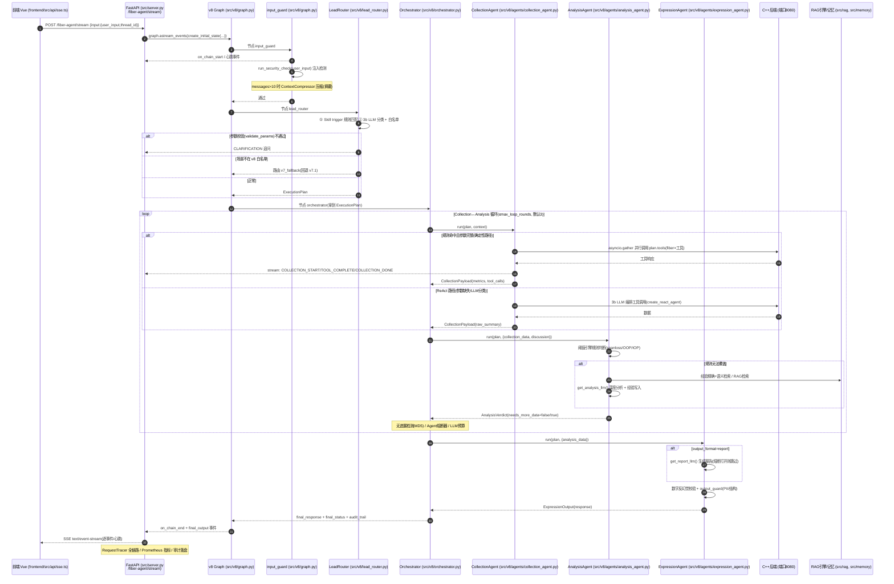
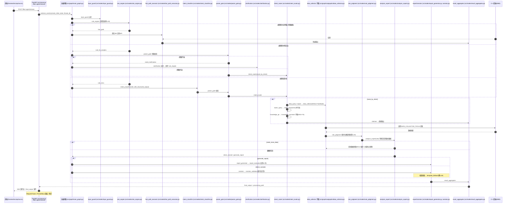
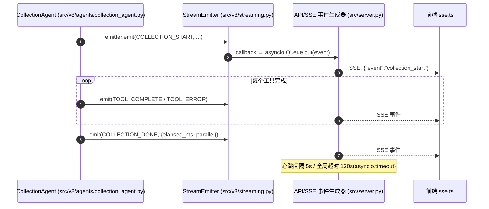

# 光纤维护 Agent 系统 — 多 Agent 组件全面分析

> 目标系统：`FiberMaintain / Agent / LangGraph-agent`
> 底座：LangChain + LangGraph（`StateGraph`），后端通过 REST 与 C++ 光纤维护服务通信，前端为 Vue 3 + TypeScript。
> 文档定位：面向开发人员的架构与组件分析，涵盖组件功能、完整时序、文件路径、使用场景。
> 书籍对齐：第 3 章组件说明已按《AI Agent 设计原理与工程实践》章节标注对应关系（见 [3.6](#36-ai-agent-设计原理与工程实践章节对齐总览)），第 8 章按落地改造项给出使用状态核查。
> 版本说明：系统包含两套架构 —— 默认生效的 **v7.1-Final 18 节点主编排图**，以及实验性的 **v8 三层能力 Agent 架构**（通过环境变量 `AGENT_MODE=v8` 启用）。

---

## 目录

1. [系统概述](#1-系统概述)
2. [总体架构与目录结构](#2-总体架构与目录结构)
3. [Agent 组件功能说明](#3-agent-组件功能说明)
   - [3.6 书籍章节对齐总览](#36-ai-agent-设计原理与工程实践章节对齐总览)
4. [完整处理时序图](#4-完整处理时序图)
5. [文件路径对照清单](#5-文件路径对照清单)
6. [测试与评估体系（tests/e2e 与 tests/eval）](#6-测试与评估体系testse2e-与-testseval)
7. [组件使用场景](#7-组件使用场景)
8. [落地改造功能使用状态核查](#8-落地改造功能使用状态核查)
9. [附录：关键配置与常量](#9-附录关键配置与常量)

---

## 1. 系统概述

本系统为**光纤维护（Fiber Maintenance）领域**的智能 Agent 编排系统。它把"规则引擎 + LLM 推理"有机融合：

- **确定性优先**：能通过正则规则、阈值引擎、参数门禁解决的查询零 LLM 调用，延迟 < 1s。
- **LLM 兜底**：规则无法覆盖的场景，按 14b / 7b / 3b 三层模型梯度逐级退化。
- **强工程治理**：全程配置熔断器、降级、审计、链路追踪、成本跟踪。
- **双架构并存**：v7.1 图节点式编排（默认）与 v8 三层能力 Agent（实验）。

核心目标：在**不编造数据**（反幻觉）、**不无限循环**（四重终止保障）、**服务不可用仍可用**（降级）的前提下，对光纤网络拓扑、性能、衰耗、告警进行查询与分析。

---

## 2. 总体架构与目录结构

```
LangGraph-agent/
├── src/                          # 后端核心（Python，FastAPI + LangGraph）
│   ├── config.py                 # 全局配置（环境变量 + .env）
│   ├── server.py                 # FastAPI 入口（/invoke、/fiber-agent/stream、/health、/metrics、/api/v1/traces、/api/v1/degradation、/api/batch/{thread_id}/progress、/api/v1/skills*）
│   ├── frontend_api.py           # 前端专用 REST API（线程/知识库/图/记忆/确认/指标）
│   ├── graph/                    # v7.1 主编排图
│   │   ├── main_graph.py         #   18 节点主图构建 + 检查点器
│   │   ├── routing.py            #   条件路由函数集
│   │   ├── state.py              #   MainGraphState + Pydantic 结构模型 + 初始化
│   │   └── subgraphs/            #   子图：data_collector / knowledge_assistant / proactive
│   ├── nodes/                    # v7.1 各节点实现（每文件一节点）
│   │   ├── input_guard.py  rule_engine.py  fast_path_executor.py
│   │   ├── intent_classifier.py  param_gate.py  clarification.py
│   │   ├── intent_router.py      rule_judgment.py  analysis_expert.py
│   │   ├── narrator.py           narrator_validator.py  template_fallback.py
│   │   ├── report_generator.py   report_evaluator.py
│   │   ├── result_aggregator.py  degradation_handler.py  batch_dispatcher.py
│   ├── v8/                       # v8 三层能力 Agent 架构（实验，AGENT_MODE=v8）
│   │   ├── graph.py              #   v8 4 节点图（input_guard → lead_router → orchestrator / v7_fallback）
│   │   ├── lead_router.py        #   LeadRouter：规则优先 + LLM 分类 + 白名单
│   │   ├── orchestrator.py       #   Orchestrator：Collection↔Analysis 循环 + Expression
│   │   ├── agents/               #   三大能力 Agent
│   │   │   ├── base.py           #      BaseAgent 抽象基类（超时/熔断/降级）
│   │   │   ├── collection_agent.py  #    数据采集
│   │   │   ├── analysis_agent.py    #    分析判断
│   │   │   └── expression_agent.py  #    表达输出（用户偏好注入 [v7.4]）
│   │   ├── models.py             #   ExecutionPlan / AgentResult / LoopContext / V8State
│   │   ├── contracts.py          #   CollectionPayload / AnalysisVerdict / ExpressionOutput
│   │   ├── streaming.py          #   流式事件 StreamEmitter / StreamEventType
│   │   ├── security.py           #   注入检测 + 参数校验 + 输出护栏
│   │   ├── resilience.py         #   Agent 级熔断器
│   │   ├── metrics.py            #   无依赖内存指标聚合（Prometheus 风格）
│   │   └── output_guard.py       #   输出侧护栏
│   ├── llm/                      # 三层 LLM 梯度（provider.py）+ 提示词（prompts.py）
│   ├── tools/                    # 34 Tool（15 领域文件，7 分组）+ _http_client.py + tool_result.py + confirmation_gate.py
│   ├── rag/                      # ChromaDB + BM25 混合检索、文档摄入、查询改写
│   ├── memory/                   # 上下文压缩、经验存储、经验整合、用户记忆（存储/注入/评估）
│   ├── cache/                    # 本地 SQLite 缓存
│   ├── events/                   # 事件路由与监听（WebSocket/主动诊断）
│   ├── skills/                   # Skill 加载、判断引擎、注册表、Schema
│   ├── governance/               # 阈值引擎、数字校验、成本跟踪、LLM 审计、报告清单
│   ├── resilience/               # 熔断器、降级管理、健康探针
│   ├── observability/            # 指标、请求跟踪、链路追踪、审计
│   └── security/                 # 输出过滤 + 工具复核（output_filter.py + tool_reviewer.py）
├── frontend/                     # Vue3 + TS 管理界面（API 客户端、SSE、WebSocket、Pinia stores）
├── prompts/                      # 提示词唯一管理点（Markdown + few-shot JSON）
├── skills/                       # Skill YAML 定义（场景声明式配置）
├── knowledge_base/               # RAG 知识库 Markdown 文档
├── config/thresholds.yaml        # 光功率/衰耗阈值标准
└── tests/                        # pytest（unit / integration / e2e / eval）
    ├── e2e/                       # 端到端测试（前端API契约 + 节点链场景，Mock 外部依赖）
    └── eval/                      # 自动化评估（规则层 + 端到端 + Rubric + 数据集）
```

---

## 3. Agent 组件功能说明

系统内"Agent 组件"分为五类，下面逐类给出**核心功能、设计目的、关键特性、技术实现**。

### 3.1 三大能力 Agent（v8 架构）⭐ 核心 【书籍第1章：LLM+上下文+工具；第4章：工具设计】

#### 3.1.1 `BaseAgent` — 三层 Agent 统一抽象 【书籍第1章：Harness 工程 / 错误治理】
- **文件**：`src/v8/agents/base.py`
- **功能**：定义三层 Agent 的统一契约与公共执行骨架（`run()` 入口）。
- **设计目的**：让三类 Agent 具备一致的"超时 → 熔断 → 异常兜底"行为，永不因单点故障而崩溃。
- **关键特性 / 技术实现**：
  - 抽象接口：`layer` 属性（COLLECTION / ANALYSIS / EXPRESSION）+ `execute()`。
  - `run()` 用 `asyncio.wait_for` 实现**分层超时**，超时值按层 + 执行模式（`execution_mode`）决定。
  - 捕获 `TimeoutError` / `CircuitOpenError` / 通用异常，统一返回 `AgentResult`，并调用 LLM 熔断器 `record_success / record_failure`。
  - `_degraded_data()` 保证 **SLA 契约：data 永不为空**（有损但可用）。
  - 成功/失败均埋点 `record_agent_execution`（Prometheus 指标）。

#### 3.1.2 `CollectionAgent` — 数据采集层（Collection）
- **文件**：`src/v8/agents/collection_agent.py`
- **功能**：根据 `ExecutionPlan.tools` 调用后端 API 获取光纤数据，输出结构化 `CollectionPayload`。
- **设计目的**：作为唯一接触后端"数据侧"的 Agent，**只采集、不做分析判断**，把"确定性数据获取"与"LLM 推理"解耦。
- **关键特性 / 技术实现**：
  - **双路径**：
    - `_deterministic_collect`：`match_type="rule"` + 参数完整 → 直接调用工具函数，**零 LLM**，<500ms。
    - `_react_collect`：参数缺失或 `match_type="llm"` → 用 3b LLM 的 `create_react_agent` 做 **Bounded ReAct**（只用 `plan.tools` 声明工具）。
  - **并行采集（P1-B）**：按"fiber × 工具"建任务，`tool_count ≥ PARALLEL_THRESHOLD(2)` 时 `asyncio.gather` 并行执行；理论加速比 min(工具数, fiber 数)。
  - **补充采集**：循环中收到 `additional_query` 时注入采集 prompt。
  - 输出：`CollectionPayload`（metrics / connections / alarms / tool_calls / raw_summary）。
  - 通过流式 `StreamEmitter` 发射 `COLLECTION_START / TOOL_COMPLETE / TOOL_ERROR / COLLECTION_DONE` 事件。

#### 3.1.3 `AnalysisAgent` — 分析判断层（Analysis）
- **文件**：`src/v8/agents/analysis_agent.py`
- **功能**：对采集结果做判断，输出 `AnalysisVerdict`，并决定是否追加采集（`needs_more_data`）。
- **设计目的**：**规则优先，LLM 兜底**——能程序化判断的绝不消耗 LLM。
- **关键特性 / 技术实现**：
  - **Phase 1 规则判断**：`get_threshold_engine()` 对 spanloss / OOP / IOP 做阈值判定；`status="UNKNOWN"` 时才走 LLM。
  - 结构化路径（typed `CollectionPayload`）与 regex fallback 路径（ReAct 的 `raw_summary`）双支持。
  - **Phase 2 LLM 深度分析（多源上下文注入 P0-B/C）**：
    - 经验记忆：`experience_store.query`（精确）+ `memory_retriever.query_hybrid`（语义）。
    - RAG 知识库：`rag_engine.retrieve` 注入相关片段。
    - 对话摘要：`conversation_summary`（上下文压缩产出）。
  - **经验学习**：当结论为 WARNING / CRITICAL 时，确定性写入经验库，形成闭环。
  - LLM 输出解析为 typed `AnalysisVerdict`；失败时降级为 `UNKNOWN`。

#### 3.1.4 `ExpressionAgent` — 表达输出层（Expression） 【书籍第2章：输出护栏；第3章：用户记忆偏好】
- **文件**：`src/v8/agents/expression_agent.py`
- **功能**：把 `AnalysisVerdict` 格式化为用户友好的多种输出，并做反幻觉校验与输出安全护栏。
- **设计目的**：**不调用后端工具、不修改结论**，只负责"往外说"，是输出质量的最后一道闸。
- **关键特性 / 技术实现**：
  - 多种格式：`narrative`（叙述）/ `table` / `report`（7b LLM 报告）/ `raw`（JSON）。
  - **反幻觉**：用 `governance/number_validator.validate_narration_numbers` 比对输出数字与 `verdict` 指标；不一致则**降级到纯模板**（`_render_narrative`）。
  - **输出护栏**：`run_output_guard`（PII 过滤 + 结构化验证），拦截则替换为安全输出。
  - LLM 报告路径会先检查 `get_llm_breaker().is_available`，熔断打开时秒退回模板。
  - 结果：`AgentResult.data = {response, format, degraded, hallucination_errors, guard_warnings}`。

---

### 3.2 编排与路由组件（v8 架构） 【书籍第1章：Harness 编排；第2章：Skills 渐进披露】

#### 3.2.1 `LeadRouter` — 场景解析器（规则优先 + LLM 兜底 + 白名单） 【书籍第2章：Skills 按需加载 + 渐进披露】
- **文件**：`src/v8/lead_router.py`
- **功能**：把用户输入解析成 `ExecutionPlan`（含 `scenario_id`、`tools`、`judgment_rules`、`output_format`、`max_loop_rounds`）。
- **三级策略**：
  1. **规则匹配**：遍历 Skill YAML 的 `trigger` 正则，命中即返回（`match_type="rule"`）。
  2. **LLM 分类**：3b LLM 结构化输出 `IntentClassification`，**必须通过 skill ID 白名单校验**，否则拒绝。
  3. **兜底**：`default_skill`（chitchat 组）或 `fallback` 计划。

#### 3.2.2 `Orchestrator` — 三层 Agent 循环控制器 【书籍第1章：ReAct 受控循环；第4章：多 Agent 协作】
- **文件**：`src/v8/orchestrator.py`
- **功能**：编排 `Collection ↔ Analysis` 循环，循环终止后交给 `Expression`，产出最终答复与审计。
- **循环终止条件**：
  - Analysis 判定完成（`needs_more_data=False`）；
  - 达到 `max_loop_rounds`（默认 3）；
  - **无进展检测**（数据签名 MD5 不变）；
  - **Agent 级熔断器**（死循环 / LLM 预算耗尽）。
- **技术实现**：内部 `LoopContext` 累积 `collection_results` / `analysis_verdicts`；每次循环对 `raw_summary` 做 MD5 签名比对；累加 `total_llm_calls`，写 `audit_trail` 与熔断器状态。

#### 3.2.3 v8 图节点与输入守卫 【书籍第2章：注入防御 + 上下文压缩】
- **文件**：`src/v8/graph.py`
- **功能**：构建 v8 图（`input_guard → lead_router → orchestrator → END`，含 `v7_fallback`）。
- **`input_guard_node`**：注入检测（`run_security_check`）+ 长度截断 + **上下文压缩（P0-A）**（超窗时 `context_compressor.compress_if_needed` 生成摘要）。拦截时 `processing_path="blocked"` 直接 END。
- **`route_after_router`**：场景白名单不命中时路由到 `v7_fallback`，回退 v7.1 处理。
- **检查点器**：复用 v7.1 的 `AsyncSqliteSaver`（懒加载），支持会话持久化与多轮追问。

---

### 3.3 主编排图节点（v7.1 默认架构，18 节点） 【书籍第1章：Harness 编排；第2章：上下文工程】

- **文件**：`src/graph/main_graph.py`（节点注册）、`src/graph/routing.py`（条件边）、`src/graph/state.py`（状态模型）。
- **主图拓扑**：
```
START → input_guard → rule_engine
└─(fast_path) fast_path_executor → result_aggregator → END
└─(rule_hit_complex) param_gate → intent_router
    └─(need_clarification) clarification → rule_engine (回环)
└─(rule_miss) intent_classifier → param_gate
intent_router ─(data_query) data_collector(子图) → rule_judgment → analysis_expert
              ─(batch_query) batch_dispatcher
              ─(knowledge_qa) knowledge_qa(子图)
              ─(report) data_collector
              ─(chitchat) result_aggregator
analysis_expert ─(need_more_data) → data_collector   # ReAct 循环
                ─(generate_report) → report_generator → report_evaluator(反思，最多 refine 1 次)
                ─(direct_narrate) → narrator → narrator_validator
                ─(degraded) → degradation_handler
narrator_validator ─(pass) result_aggregator / (fail) template_fallback
```
- **18 个节点职责**（node → 文件，位于 `src/nodes/`）：

| # | 节点 | 职责 | 设计要点 |
|---|------|------|---------|
| 1 | input_guard | 注入检测 + 长度截断 | 拦截即 `processing_path=blocked` |
| 2 | rule_engine | 正则意图识别 | 零 LLM |
| 3 | fast_path_executor | 规则命中直接查 API | 跳过 LLM，<1s |
| 4 | intent_classifier | LLM 识别未命中意图 | 14b，`with_structured_output` |
| 5 | param_gate | 参数完整性校验 | 输出 `NormalizedParams` |
| 6 | clarification | 追问缺失参数 | 回环 rule_engine |
| 7 | intent_router | 意图分发 | 交由 `route_by_intent` |
| 8 | data_collector | 数据收集子图 | ReAct + ToolNode（后详） |
| 9 | batch_dispatcher | 批量拆分并行 | 每块 ≤50 |
| 10 | knowledge_qa | 知识问答子图 | RAG + 7b 生成 |
| 11 | rule_judgment | 程序化阈值判断 | 零 LLM |
| 12 | analysis_expert | LLM 判断是否补数 | 决定循环/输出 |
| 13 | narrator | 结构化→自然语言 | 7b |
| 14 | narrator_validator | 数字反幻觉校验 | 失败→模板 |
| 15 | template_fallback | 模板兜底 | 零 LLM |
| 16 | report_generator | 结构化维护报告 | 14b |
| 17 | report_evaluator | 报告质量评估 | 反思 ≤1 次 |
| 18 | result_aggregator | 聚合各路径输出 | 最终回复 |
| + | degradation_handler | 降级策略 | 服务不可用兜底 |

- **四重终止保障**（`route_after_analysis`）：① 轮次上限 `loop_count≥max_loops`；② LLM 预算 `llm_call_count≥max_llm_calls`；③ 无进展 `no_progress_count≥2`；④ 工具全失败 → 降级。

---

### 3.4 子图 Agent 【书籍第1章：ReAct 循环；第4章：事件触发异步 Agent】

#### 3.4.1 Data Collector 子图（数据收集） 【书籍第1章：ReAct 循环】
- **文件**：`src/graph/subgraphs/data_collector.py`
- **功能**：v7.1 中**唯一绑定后端 API 工具的组件**（P2 原则）。内部用 `create_react_agent` + `DATA_COLLECTOR_TOOLS` 自动工具调用。
- **技术实现**：LLM 为 qwen2.5:14b / temperature 0.0，`recursion_limit=10`；按 `MainGraphState` 上下文（用户输入、归一化参数、`analysis_verdict.additional_query`）构建采集 prompt；输出截断到 3000 字符。

#### 3.4.2 Knowledge Assistant 子图（知识问答）
- **文件**：`src/graph/subgraphs/knowledge_assistant.py`
- **功能**：RAG 检索 + LLM 答案生成（7b）。
- **流程**：`_retrieve_knowledge`（`rag_engine.retrieve top_k=5`）→ `KNOWLEDGE_QA_PROMPT | llm` → 答案。RAG 或 LLM 不可用时优雅降级（返回检索原文或免责说明）。

#### 3.4.3 Proactive 子图（主动诊断） 【书籍第4章：事件触发工具 → 异步 Agent】
- **文件**：`src/graph/subgraphs/proactive.py`
- **功能**：**事件触发**的无用户交互自动诊断：`EventTrigger → QuickCollect → AutoAnalyze → Alert`。
- **触发条件**：CRITICAL 告警、GREEN→RED 颜色升级。
- **技术实现**：10s 总超时；`_diagnose` 直连 `fiber_http_client` 取性能/衰耗，按 `SPANLOSS_THRESHOLD` 阈值判定；CRITICAL 时生成告警消息。

---

### 3.5 支撑中台组件

这些不是"Agent"本身，但被 Agent 强依赖，构成了系统的"决策/安全/观测底座"。

| 模块（目录） | 组件 | 职责 | 文件 |
|------|------|------|------|
| `tools/` | 领域 Tool 集 | 34 个唯一 Tool，分 7 组（18 数据采集 / 2 分析 / 4 报告 / 3 知识 / 4 内部 / 3 工单 / 1 代码编排；部分工具跨组复用，故组内计数之和可大于工具总数） | `DATA_COLLECTOR_TOOLS` / `ANALYSIS_TOOLS` / `REPORT_TOOLS` / `KNOWLEDGE_TOOLS` / `INTERNAL_TOOLS` / `PULLCALL_TOOLS` / `CODING_TOOLS`（`tools/__init__.py`） |
| `tools/` | HTTP 客户端 | 统一调 C++ 后端，熔断/超时/重试 | `tools/_http_client.py` |
| `tools/` | ToolResult | 结构化工具返回值 | `tools/tool_result.py` |
| `tools/` | 确认门禁 | 写操作 HITL（pending → confirm token） | `tools/confirmation_gate.py` |
| `skills/` | Skill 系统 | YAML 声明式场景（trigger/routing/tools/judgment） | `skills/loader.py` `judgment_engine.py` `schema.py` + `skills/*.yaml` |
| `rag/` | RAG 引擎 | ChromaDB + BM25 混合检索、文档摄入、查询改写 | `rag/engine.py` `ingest.py` `query_rewriter.py` |
| `memory/` | 记忆体系 | 上下文压缩、经验存储、经验整合/淘汰、用户记忆（SQLite 存储/偏好注入/质量评估） | `memory/context_compressor.py` `experience_store.py` `consolidator.py` `memory_retriever.py` `user_memory.py` `user_memory_store.py` `memory_eval.py` |
| `resilience/` | 韧性与降级 | Agent熔断、LLM熔断、降级管理、健康探针 | `resilience/agent_circuit_breaker.py` `degradation.py` `health_probe.py` |
| `governance/` | 治理 | 阈值引擎、数字校验、报告清单、成本跟踪、LLM审计、工具风险分级 | `governance/threshold_engine.py` `number_validator.py` 等 |
| `observability/` | 可观测 | Prometheus 指标、请求跟踪、链路追踪、审计 | `observability/metrics.py` `request_tracer.py` `tracing.py` `audit.py` |
| `security/` | 安全 | 输出过滤 + 服务端工具复核 | `security/output_filter.py` `tool_reviewer.py` |
| `events/` | 事件 | 事件路由/监听（WebSocket/主动诊断入口） | `events/router.py` `listener.py` |
| `cache/` | 本地缓存 | SQLite 缓存层 | `cache/local_cache.py` |

---

### 3.6 《AI Agent 设计原理与工程实践》章节对齐总览

> 本节把书籍十章的核心理念映射到本系统组件，说明"书籍原则 → 本系统落地"的对应关系。
> 对齐等级：✅ 已对齐（组件实现与书籍原则一致）｜⚠️ 部分对齐（有对应实现但缺某方面）｜⛔ 不适用（书籍章节主题超出本系统范围）。
> 详细的分章落地改造方案见 [2026-08-20-ch2to6-landing-plan.md](plans/2026-08-20-ch2to6-landing-plan.md)。

**正向视图（书籍章节 → 系统组件）**：

| 书籍章节 | 核心理念 | 本系统对应组件 / 机制 | 对齐状态 |
|---|---|---|---|
| 第1章 Agent 基础知识 | Agent = LLM + 上下文 + 工具；ReAct 循环；Harness 工程 | 三层 LLM 梯度（`llm/`）；v7.1 18 节点图 + v8 三层图（`graph/`、`v8/`）；`data_collector` ReAct 受控循环；input_guard / narrator_validator / report_evaluator 等 Harness 校验节点 | ✅ 已对齐 |
| 第2章 上下文工程 | 提示工程、注入攻防、Agent Skills、状态栏、上下文压缩、任务状态显式维护 | `input_guard.py`（注入检测分层）；`skills/`（按需加载）；`status_bar.py`（状态栏）；`context_compressor.py`（上下文压缩）；`task_context.py`（任务内记忆） | ✅ 已对齐 |
| 第3章 用户记忆与知识库 | 用户记忆策略、RAG、经验"保存≠学习"、复盘整合 | `user_memory.py` / `user_memory_store.py`（用户偏好注入）；`rag/engine.py`（向量+BM25 混合检索）；`experience_store.py`（经验写入 + 质量 veto）；`consolidator.py`（离线复盘/整合/淘汰） | ✅ 已对齐 |
| 第4章 工具 | 工具五类设计、执行工具安全机制、事件驱动异步 Agent | 34 Tool / 7 分组（`tools/`）；`tool_result.py`（结构化返回）；`tool_risk.py`（风险分级）；`confirmation_gate.py`（HITL）；`tool_reviewer.py`（服务端复核）；`events/` + `proactive.py`（事件触发主动诊断） | ✅ 已对齐（MCP 适配器未接入 → ⚠️ 部分） |
| 第5章 Coding Agent | 代码生成与验证、错误恢复、保留集 | `code_orchestrator.py`（AST 验证 + 失败重建 + 保留集校验，注册为 `execute_code_plan` Tool） | ⚠️ 部分（已注册为 Tool，未绑定在线执行场景） |
| 第6章 Agent 的评估 | 评估环境、数据集、LLM-as-a-Judge、统计显著性 | `tests/eval/`（checks.py 确定性检查 + rubric_judge.py 异源裁判 + failure_diagnosis.py Pass@k/归因聚合）；`scripts/run_eval.py`（门禁退出码） | ✅ 已对齐 |
| 第7章 模型后训练 | SFT / 强化学习 | 无（依赖商用/开源预训练模型，不做模型训练） | ⛔ 不适用 |
| 第8章 Agent 的持续进化 | 学习信号、更新载体、灰度发布/回滚/整理 | `consolidator.py`（经验整理/淘汰）；`experience_store.py`（质量 veto 学习信号）；`scripts/regression_gate.py`（变更回归门禁） | ⚠️ 部分（无灰度发布/回滚链路） |
| 第9章 多模态与实时交互 | 语音、Computer Use、机器人 | 无 | ⛔ 不适用 |
| 第10章 多 Agent 协作 | 协作分类框架（上下文共享/独立 × 对等/管理者/去中心化） | v8 三层能力 Agent（Collection / Analysis / Expression 分工协作，Orchestrator 为管理者）；v7.1 多子图并行处理（data_collector / knowledge_assistant / proactive） | ✅ 已对齐（内部多 Agent 协作） |

**反向视图（系统组件 → 书籍章节）**：阅读第 3.1–3.5 各组件时，可用上表定位其对应的书籍章节；第 8 章已按"落地改造项"粒度给出使用状态核查。

---

## 4. 完整处理时序图

> 约定：所有文件路径以 `LangGraph-agent/` 为根。图中 `❯` 标注当前步骤涉及的关键文件。

### 4.1 从前端输入到最终结果 —— v8 三层架构（`AGENT_MODE=v8`）



### 4.2 从前端输入到最终结果 —— v7.1 主编排图（默认，18 节点）



### 4.3 流式事件到前端（StreamEmitter 路径）



---

## 5. 文件路径对照清单

> 根目录均为 `LangGraph-agent/`。

### 5.1 v8 三层能力 Agent 架构

| 组件 | 文件 |
|------|------|
| v8 图构建 / 输入守卫 | `src/v8/graph.py` |
| LeadRouter（场景解析） | `src/v8/lead_router.py` |
| Orchestrator（循环编排） | `src/v8/orchestrator.py` |
| BaseAgent 抽象 | `src/v8/agents/base.py` |
| CollectionAgent | `src/v8/agents/collection_agent.py` |
| AnalysisAgent | `src/v8/agents/analysis_agent.py` |
| ExpressionAgent | `src/v8/agents/expression_agent.py` |
| v8 数据模型 | `src/v8/models.py` |
| v8 Agent 间契约 | `src/v8/contracts.py` |
| 流式事件 | `src/v8/streaming.py` |
| 安全（注入/参数/护栏） | `src/v8/security.py` |
| 输出护栏 | `src/v8/output_guard.py` |
| Agent 级熔断 | `src/v8/resilience.py` |
| 指标聚合（无依赖内存） | `src/v8/metrics.py` |
| 场景迁移/白名单 | `src/v8/migration.py` |

### 5.2 v7.1 主编排图

| 组件 | 文件 |
|------|------|
| 主编排图构建 + 检查点器 | `src/graph/main_graph.py` |
| 条件路由函数集 | `src/graph/routing.py` |
| 状态模型 / 初始化 | `src/graph/state.py` |
| 数据收集子图 | `src/graph/subgraphs/data_collector.py` |
| 知识问答子图 | `src/graph/subgraphs/knowledge_assistant.py` |
| 主动诊断子图 | `src/graph/subgraphs/proactive.py` |
| 全部 18 节点 | `src/nodes/*.py`（input_guard 至 result_aggregator） |

### 5.3 入口与 API

| 组件 | 文件 |
|------|------|
| FastAPI 应用 / invoke / SSE / health / metrics | `src/server.py` |
| 链路追踪查询（/api/v1/traces、/api/v1/traces/{id}） | `src/server.py` |
| 降级状态（/api/v1/degradation）/ 批量进度（/api/batch/{thread_id}/progress） | `src/server.py` |
| 规则/技能热重载与技能列表（/api/v1/rules/reload、/api/v1/skills*） | `src/server.py` |
| 前端管理 API（知识库/线程/图/记忆/确认/指标） | `src/frontend_api.py` |
| 全局配置 | `src/config.py` |
| 前端 API 客户端 / SSE | `frontend/src/api/sse.ts` `frontend/src/api/agent.ts` 等 |
| SSE 兼容回调（队列） | `src/v8/streaming.py`（`create_sse_callback`） |

### 5.4 支撑组件

| 组件 | 文件 |
|------|------|
| Tool 集（7 组） | `src/tools/__init__.py` |
| HTTP 客户端（熔断/超时/重试） | `src/tools/_http_client.py` |
| ToolResult / ToolExecutor | `src/tools/tool_result.py` |
| 确认门禁（HITL） | `src/tools/confirmation_gate.py` |
| Skill 加载 / 判断 / Schema | `src/skills/loader.py` `judgment_engine.py` `schema.py` `registries.py` |
| Skill YAML（场景定义） | `skills/*.yaml` |
| RAG 引擎 / 摄入 / 改写 | `src/rag/engine.py` `ingest.py` `query_rewriter.py` |
| 记忆（压缩/经验/整合/语义/用户） | `src/memory/context_compressor.py` `experience_store.py` `consolidator.py` `memory_retriever.py` `user_memory.py` `user_memory_store.py` `memory_eval.py` |
| 韧性（熔断/降级/探针） | `src/resilience/agent_circuit_breaker.py` `degradation.py` `health_probe.py` |
| 治理（阈值/数字/清单/成本/审计/风险） | `src/governance/threshold_engine.py` `number_validator.py` `report_checklist.py` `cost_tracker.py` `llm_audit.py` `tool_risk.py` |
| 可观测（指标/追踪/链路/审计） | `src/observability/metrics.py` `request_tracer.py` `tracing.py` `audit.py` |
| 安全（输出过滤 + 工具复核） | `src/security/output_filter.py` `tool_reviewer.py` |
| 事件路由/监听 | `src/events/router.py` `listener.py` |
| 本地缓存 | `src/cache/local_cache.py` |
| 提示词（唯一管理点） | `prompts/**` |
| 知识库 | `knowledge_base/**` |
| 阈值标准 | `config/thresholds.yaml` |

### 5.5 测试与评估

| 组件 | 文件 |
|------|------|
| E2E 前端 API 契约测试 | `tests/e2e/test_e2e_frontend_api.py` |
| E2E 节点链场景测试 | `tests/e2e/test_e2e_scenarios.py` |
| 规则层 QA 数据集 | `tests/eval/qa_dataset.json` |
| 端到端数据集 | `tests/eval/e2e_dataset.json` |
| 规则层评估运行器（零 LLM） | `tests/eval/runner.py` |
| 端到端评估运行器 | `tests/eval/e2e_runner.py` |
| 确定性检查器（含幻觉 veto） | `tests/eval/checks.py` |
| Rubric LLM 评判器 | `tests/eval/rubric_judge.py` |
| 评估统一入口 / 门禁脚本 | `scripts/run_eval.py` |
| 回归门禁（pre-commit） | `scripts/regression_gate.py` `.pre-commit-config.yaml` |

---

## 6. 测试与评估体系（tests/e2e 与 tests/eval）

> 系统不是只"能跑"，还投入了完整的**端到端测试**与**自动化评估（含回归门禁）**基础设施。
> 二者分工：`tests/e2e` 是**确定性验证**（Mock 外部依赖，验证节点/API/SSE 行为是否正确）；`tests/eval` 是**质量度量**（真实/规则层执行，量化准确率、延迟、幻觉，作为回归基线）。
> 评估方法论源自"AI Agent 设计原则 Chapter 6 —— 系统级验证"：确定性检查先行 → 失败归因首个错误 → Rubric LLM 评判其后。

### 6.1 E2E 端到端测试（tests/e2e）

| 文件 | 职责 | 关键测试类/用例 |
|------|------|----------------|
| `tests/e2e/test_e2e_frontend_api.py` | 验证 **Agent 服务器与 Vue 前端 API 契约兼容** | 见下方细分 |
| `tests/e2e/test_e2e_scenarios.py` | 仿真**真实用户沿完整节点链**的交互（外部依赖全 Mock） | 见下方细分 |

**`test_e2e_frontend_api.py`**（基于 `httpx.AsyncClient + ASGITransport` 直接驱动 `src.server.create_app`）：
- `TestInvokeResponseFormat`：验证 `/invoke` 响应结构（`result`/`processing_path`/`latency_ms`/`request_id`）及错误格式（含 `detail`）。
- `TestFrontendDataAPIs`：验证前端仪表盘依赖的 `/health`、`/api/v1/rules/reload`。
- `TestSSEStreamFormat`：验证前端 `sse.ts` 期望的 `data: ` 前缀、`data: [DONE]` 终止信号、各事件类型可解析性。
- `TestThreadContinuity`：验证 `thread_id` 正确透传到图配置，缺失时回退 `default`。

**`test_e2e_scenarios.py`**（直接调用节点函数 + `create_initial_state` + 路由函数，`mock_backend` fixture）：
- `TestE2ESingleFiberQuery`：快速路径全链路（input_guard → rule_engine → fast_path_executor），并断言快路径**零 LLM 调用**。
- `TestE2EColorDiagnosis`：颜色诊断 → `rule_hit_complex` → `data_query` 路由。
- `TestE2EBatchQuery` / `TestE2EKnowledgeQA` / `TestE2EReportGeneration`：批量/知识/报告的意图识别与 `route_by_intent` 路由。
- `TestE2EAbnormalInputs`：注入拦截、空输入、超长输入截断（2000 字符）、SQL 注入拦截。
- `TestE2ENarratorValidation`：叙述数字校验通过→聚合、幻觉→模板降级。
- `TestE2EDegradationScenario`：降级等级 ≥2 强制走 degraded，等级 0 允许继续循环。

### 6.2 自动化评估体系（tests/eval）

**评估分层架构**：
```
规则层快速评估 (runner.py, 零LLM)  ── 日常门禁
        │
端到端评估 (e2e_runner.py, 真实LLM) ┐
        │  ├ 确定性检查 (checks.py) ── 先行，幻觉 veto 一票否决
        │  └ Rubric LLM 评判 (rubric_judge.py) ── 仅确定性全过的用例
        └ 基线对比 (data/eval/e2e_baseline.json) ── 配对下降检测
```

| 文件 | 职责 | 关键类/说明 |
|------|------|------------|
| `tests/eval/qa_dataset.json` | **规则层 QA 标注集** | 9 个 v7 intent + 注入对抗用例；`expected_intent` 为 v7 词表，`v8_mode_skill` 为 v8 LeadRouter skill-id（对比评估用）；`pass_criteria` 声明门槛（intent 1.0 / injection 1.0 / param 0.9） |
| `tests/eval/e2e_dataset.json` | **端到端数据集**（真实调用主图） | 按意图分布 + injection + boundary；`expected_tools` 为可接受工具集合，数据类用例必须调用至少一个 |
| `tests/eval/runner.py` | `EvalRunner` — 规则层快速评估 | **零 LLM**（同步调 `LeadRouter._rule_match`），度量：意向准确率 / 注入拦截率 / 参数保真度 / P50·P95 延迟；`compare_with_baseline` 做退化检测 |
| `tests/eval/e2e_runner.py` | `E2ERunner` — 端到端评估 | 真实 `graph.ainvoke`（`CASE_TIMEOUT_S=180`）；**顺序执行**避免并发压垮本地推理；逐用例 print 进度 |
| `tests/eval/checks.py` | 确定性检查器 | 6 项：injection / intent / params / tools / numbers / path；**幻觉 veto**（`check_numbers` → `check_numbers_grounded`）；`first_failure` 定位首个错误；降级路径自动 skip 防误杀 Harness |
| `tests/eval/rubric_judge.py` | `RubricJudge` — LLM 软维度评判 | `factual_accuracy`/`completeness`/`compliance`/`expression`（各 1-4 分）；走 `EVAL_JUDGE_MODEL`（默认 qwen3-max）+ OPENAI 通道；无 Key 自动跳过 |

### 6.3 评估指标与门禁

**接口层**（`tests/eval`）常用指标与目标：

| 指标 | 含义 | 目标 |
|------|------|------|
| 意图准确率 | 规则/LLM 意图分类与预期一致 | ≥ 95%（e2e 中由基线兜底） |
| 注入拦截率 | 恶意输入被 input_guard 拦截 | 100% |
| 参数保真度 | 归一化参数与预期一致 | ≥ 90% |
| 幻觉 veto | 输出数字无溯源则直接判 fail | 0 |
| P50 / P95 延迟 | 响应延迟分位点 | < 2s / < 5s |

**入口脚本与退出码**（`scripts/run_eval.py`）：
```
python scripts/run_eval.py              # 规则层快速评估（零 LLM，日常门禁）
python scripts/run_eval.py --e2e        # + 端到端评估（真实 LLM，里程碑）
python scripts/run_eval.py --e2e --rubric   # + Rubric LLM 评判（需 OPENAI_API_KEY）
# 退出码：1=规则层意图准确率<95% 或 e2e 通过率低于基线；2=注入拦截率<100%；3=幻觉 veto 触发
```
- 基线：`data/eval/e2e_baseline.json`，首次运行自动建立，后续 `pass_rate` 不得回落（配对下降检测）。
- 报告落盘：`data/eval_report.json`（规则层）、`data/e2e_eval_report.json`（端到端）。
- `--e2e` 模式下规则层门禁降级为**警告**，不阻塞里程碑端到端运行。

**回归门禁**（`scripts/regression_gate.py`，已挂到 `.pre-commit-config.yaml`）：
- `WATCHED_PREFIXES = ("prompts/", "skills/", "config/thresholds")`，检测到这些文件 staged 变更即自动执行 `pytest tests/unit/`。
- 退出码 0 = 通过/无相关变更；1 = 回归失败，阻止 commit（保证提示词/技能/阈值改动不破坏既有行为）。

---

## 7. 组件使用场景

### 7.1 v8 三大能力 Agent

| 组件 | 业务场景 | 触发条件 | 使用限制 |
|------|---------|---------|---------|
| **CollectionAgent** | 光纤性能/衰耗/告警/拓扑数据查询的高效获取 | 任一查询意图；`AGENT_MODE=v8` | 确定性路径要求 `match_type=rule` 且参数含 `fiber_ids`；只采集不分析；Bounded ReAct 只用 `plan.tools`；结果截断 3000 字符 |
| **AnalysisAgent** | 数据健康状态研判（NORMAL/WARNING/CRITICAL）、是否需要补数 | 采集完成之后；规则引擎可能无法覆盖 | 规则命中即跳过 LLM；LLM 依赖经验库/RAG/摘要注入；WARNING/CRITICAL 才写经验库；失败降级为 UNKNOWN |
| **ExpressionAgent** | 运维分析结论的口语化/表格/报告输出 | Analysis 产出 verdict 之后；报告类意图 | 不调用工具、不修改结论；report 依赖 7b LLM 且受熔断器约束；数字与事实不一致/护栏拦截时降级模板 |

### 7.2 编排与路由组件

| 组件 | 业务场景 | 触发条件 | 使用限制 |
|------|---------|---------|---------|
| **LeadRouter** | 把自由文本解析为可执行场景计划 | 输入通过 input_guard；v8 | 规则优先；LLM 分类必须过白名单；兜底 `default_skill`/`fallback` |
| **Orchestrator** | 多轮"采集-分析"迭代直至结论 | v8 且计划落在白名单场景 | 终止受 `max_loop_rounds`、无进展 MD5、Agent 熔断、LLM 预算共同约束 |
| **v8 输入守卫** | 注入拦截 / 长对话上下文压缩 | 所有请求首站 | 压缩仅当 messages>10 且启用 `use_llm=True`；压缩失败静默放行 |

### 7.3 v7.1 主编排图（默认）节点

| 组件 | 业务场景 | 触发条件 | 使用限制 |
|------|---------|---------|---------|
| **rule_engine** | 高确定性查询（"查光纤X告警"） | 默认模式首站 | 依赖 Skill YAML trigger 正则；`fast_path_eligible` 才走快路径 |
| **fast_path_executor** | 单条规则命中查询，需低延迟 | `rule_engine` 返回 `fast_path` | 只能处理规则完全覆盖的简单查询；不触发 LLM |
| **intent_classifier** | 规则未命中的模糊意图识别 | `rule_miss` | 消耗 14b LLM Call；输出必须结构化（`with_structured_output`） |
| **param_gate / clarification** | 参数校验与缺失追问 | 复杂路径 | 校验失败进入 `clarification` 回环；受 MAX_LOOPS 限制 |
| **data_collector 子图** | 数据收集 + ReAct"思考-行动"循环 | `data_query`/`report` 意图 | 唯一绑后端 Tool 的组件；`recursion_limit=10`；无进展会熔断 |
| **memory/proactive 等支撑** | 知识问答、主动告警诊断、状态持久化 | 对应意图或事件（告警/颜色升级） | 主动诊断 10s 超时；RAG/LLM 不可用时可降级 |

### 7.4 支撑中台组件

| 组件 | 业务场景 | 触发条件 | 使用限制/注意事项 |
|------|---------|---------|------------------|
| **Skill 系统** | 声明式新增/扩展场景（新意图、工具、阈值） | 新增/修改 `skills/*.yaml` | 修改需重载注册表；trigger 正则需与测试用例对齐；提示词/技能/Skill 变更会触发 regression 门禁 |
| **RAG 引擎** | 知识库问答、分析时注入领域知识 | AnalysisAgent / knowledge_qa 子图 | 依赖 ChromaDB + embedding（bge-large, 1024 维）；KB 需预先 ingest |
| **记忆体系** | 多轮上下文保持、跨会话经验复用 | 对话超窗 / WARNING,CRITICAL 结论 | ContextCompressor 用摘要替代滑动窗口，保留光纤ID/时间关键实体；经验库精确+语义混合检索 |
| **熔断 / 降级** | 服务抖动、LLM 不可用时的保底 | 失败率超阈值 / 工具全失败 | 熔断触发后走降级路径（有损但可用）；降级等级≥2 禁止循环 |
| **治理 / 观测 / 安全** | 阈值判定、数字反幻觉、成本、审计、指标、输出过滤 | 贯穿所有路径 | 数字校验失败降级模板；输出护栏拦 PII；审计落 `data/audit.jsonl` |

### 7.5 测试与评估组件

| 组件 | 业务场景 | 触发条件 | 使用限制/注意事项 |
|------|---------|---------|------------------|
| **test_e2e_frontend_api** | 验证后端 REST/SSE 契约与 Vue 前端兼容 | 前端 API 改动 / 接口字段调整 | 需预启动或以 ASGI transport mock 应用；验证的是"格式契约"而非业务正确性 |
| **test_e2e_scenarios** | 验证完整节点链的业务行为 | 节点/路由/守卫逻辑改动 | 外部依赖（LLM/后端/RAG）必须 Mock；仅覆盖 v7 路径 |
| **EvalRunner（规则层）** | 日常门禁：量化意图/注入/参数/延迟 | `python scripts/run_eval.py` | **零 LLM**（同步 `_rule_match`）；适合 CI 常跑 |
| **E2ERunner（端到端）** | 里程碑评估：真实主图全链路质量 | `--e2e`，需真实 LLM/后端 | 单用例 180s 超时；顺序执行防压垮本地；慢，不常跑 |
| **checks.py** | 确定性检查 + 幻觉 veto + 失败归因 | E2ERunner 内部自动执行 | 注射用例只跑 injection 检查；降级路径自动 skip 防误杀 |
| **RubricJudge** | 输出软维度打分（事实/完整/合规/表达） | `--rubric`，需 `OPENAI_API_KEY` | LLM 评判仅限确定性全过的用例；无 Key 自动跳过不阻塞 |
| **run_eval.py 门禁** | 评估退出码门禁 + 基线对比 | 提交前 / CI | 退出码 1/2/3 分别对应用例、注入、幻觉 vetos，可阻止发布 |
| **regression_gate.py** | 提示词/技能/阈值变更自动回归 | pre-commit（`.pre-commit-config.yaml`） | 仅监听 `prompts/`、`skills/`、`config/thresholds` 变更；失败阻止 commit |

---

## 8. 落地改造功能使用状态核查

> 本表逐项核查 `docs/plans/2026-08-20-ch2to6-landing-plan.md` 中已实现的改造项，
> 依据当前源码静态分析确认：**是否接入实际运行链路、在什么条件下触发、对哪套架构生效**。
> 结论分四类：✅ 在线生效 / ⚠️ 仅单架构生效 / 🔬 仅评估链路 / ⛔ 未接入运行时。
> **与 3.6 的关系**：3.6 是"书籍章节 → 系统组件"的宏观对齐总览；本章是"落地改造项 → 使用状态"的微观核查，二者互补。

### 8.1 在线运行时生效（✅ 默认 v7.1 与 v8 均生效）

| 改造项 | 文件 | 运行时触发条件 | 接入点 |
|------|------|--------------|--------|
| 经验写入质量 veto（Phase 2-1） | `src/memory/experience_store.py` | 分析结论 severity 为 **WARNING/CRITICAL** 且 fiber_key 非空时确定性写入 | `analysis_expert.py:313`（v7.1）与 `analysis_agent.py:326`（v8）都调用 `store.save()`，内部 `_passes_quality_veto` 校验数字溯源 |
| degraded 语义完善（Phase 2-4） | `src/tools/tool_result.py` | `ToolExecutor.run` 超时 → 返回 `status="degraded"`（可重试），区别于 error | 所有工具调用统一经 `ToolExecutor`，v7.1 与 v8 共用 |
| rule_engine 回归修复（Phase 1-5） | `src/nodes/rule_engine.py` | 移除了过宽的 `分析.*原因` 启发式，分析类查询改为精确命中 R101/R104 | v7.1 `rule_engine` 节点，零 LLM 首站 |

### 8.2 仅单架构生效（⚠️ v7.1 默认架构使用，v8 有独立实现但缺此能力）

| 改造项 | 文件 | 触发条件 | 说明 |
|------|------|---------|------|
| 注入检测分层（Phase 2-5） | `src/nodes/input_guard.py` | 强规则 9 条命中 → `blocked` 拦截；弱规则 6 条命中 → `injection_suspicion` + `guard_notice` 标记，`guard_notice` 注入 `analysis_expert` prompt（`analysis_expert.py:87`） | v7.1 图首节点（`main_graph.py:144` `START→input_guard`）。**v8 的 `src/v8/security.py` 只有单层强规则 `INJECTION_PATTERNS`，无分层** |
| 状态栏预算/degraded 统计（Phase 1-3） | `src/nodes/status_bar.py` | 每个分析回合注入剩余 LLM 预算与降级工具数 | 仅 `analysis_expert`（v7.1）注入 `{status_bar}`；v8 `analysis_agent` 用自建 prompt 模板，不注入 |
| TaskContext 任务内记忆（Phase 2-2） | `src/context/task_context.py` | `intent_router` 写 `task_plan`，`result_aggregator` 回写进度，`analysis_expert` 注入 `{task_context}` | 仅 v7.1 链路；v8 无 task_plan/task_progress 字段 |

### 8.3 仅评估/离线链路使用（🔬 不进入在线推理）

| 改造项 | 文件 | 触发条件 | 说明 |
|------|------|---------|------|
| 承诺-行动一致性 + 无证据陈述（Phase 1-1） | `tests/eval/checks.py` | `run_all_checks` 在 e2e 评估每个用例时自动执行 | 仅评估链路 |
| 异源裁判（Phase 1-4） | `tests/eval/rubric_judge.py` + `.env.example` | `--rubric` 启用，且确定性检查全过 | 仅评估链路 |
| Pass@k / 错误归因聚合（Phase 2-7） | `tests/eval/failure_diagnosis.py` + `e2e_runner.py` + `run_eval.py` | `--passk` 启用；`E2EReport` 每次返回自动聚合失败归因 | 仅评估链路 |

### 8.4 已接线（✅ [v7.4] 集成方案落地，2026-08-20）

> 以下 5 项此前处于"已实现未接线"状态，现已按 `docs/plans/2026-08-20-integration-plan.md` 全部接入运行时。
> 验收：新增/修改接线点均有单测覆盖（正向 + 降级跳过），全量回归 `pytest -q` → **834 passed, 0 failed** 无退化（2026-08-20）。
> SSE 测试跨循环泄漏修复：`tests/conftest.py` autouse fixture 重置 `sse_starlette.sse.AppStatus` 全局单例。

| 改造项 | 文件 | 接线点 | 降级路径（user_id 缺失/异常时静默跳过） |
|------|------|------|------|
| user_memory 用户记忆/个性偏好（第3章） | `src/memory/user_memory.py` | v7.1：`result_aggregator.py` 组装输出前注入 `user_preferences`；v8：`expression_agent.py:execute()` 入口改写 `plan.output_format`；`state.py`/`v8/models.py` 新增 `user_id` 字段（取自环境变量 `FIBER_USER_ID`） | 无 `user_id` → 跳过注入；异常 → warning 不中断 |
| output_filter 输出脱敏（第2章） | `src/security/output_filter.py` | `result_aggregator.py` 所有最终输出路径统一经 `output_filter.filter()`（IP 掩码/错误详情隐藏，默认角色 operator） | 纯字符串处理，无异常路径 |
| consolidator 经验整合/淘汰（Phase 2-6） | `src/memory/consolidator.py` | `frontend_api.py` 新增 `POST /api/v1/memory/consolidate`（支持 `dry_run` 预览，零 LLM 离线整理，不阻塞在线推理） | 端点异常 → 500 明确报错 |
| tool_reviewer 服务端独立复核（Phase 2-3） | `src/security/tool_reviewer.py` | `pullcall_tools.py:_pending_confirmation_json` 在 `confirmation_gate.request()` **之前**调用 `review()`；不通过 → `REVIEW_BLOCKED` 拒绝进入前端确认面板（提案者-审核者分离） | 参数合法 → 通过，行为不变 |
| code_orchestrator 失败重建 + 保留集（Phase 1-2） | `src/tools/code_orchestrator.py` | 新增 `execute_code_plan` LangChain Tool（`args_schema` 校验 goal/data_json），注册进 `tools/__init__.py` 并加入 `CODING_TOOLS` 分组 | 非法 data_json → ValueError；执行失败 → status=error JSON |

### 8.5 建议删除（⛔ 无运行时调用，被替代 — ✅ 已删除 2026-08-20）

| 文件 | 现状 | 被替代者 | 状态 |
|------|------|---------|------|
| `src/tools/dynamic_discovery.py` | 仅被 `test_p2_features.py` 测试，无运行时调用 | Skill 系统 `trigger` 正则 + LeadRouter 路由 | ✅ 已删除 |
| `src/tools/aci_spec.py` | 仅被 `dynamic_discovery.py` 引用 | 工具 `description` / `ToolResult` 契约 | ✅ 已删除（含 `test_aci_spec.py`） |

> **核查结论（更新版）**：plan 文档中 21 项功能，在线链路约 14 项（9 项原有 + 5 项本次集成），
> 6 项仅评估链路（8.3），2 项建议删除（8.5，已删除）。
> 详细集成方案见 [2026-08-20-integration-plan.md](plans/2026-08-20-integration-plan.md)。

---

## 9. 附录：关键配置与常量

> 见 `src/config.py`（环境变量驱动，参考 `.env.example`）。

| 常量 | 默认值 | 说明 |
|------|--------|------|
| `AGENT_MODE` | （空=v7.1） | `v8` 时启用三层能力 Agent 架构 |
| `OLLAMA_BASE_URL` | `http://localhost:11434` | 本地 LLM 服务 |
| `LLM_CONFIG` | primary 14b / secondary 7b / tertiary 3b | primary：意图分类+分析+报告；secondary：叙述+知识+改写；tertiary：兜底 |
| `FIBER_BACKEND_URL` | `http://localhost:8080` | C++ 后端地址 |
| `WS_BACKEND_URL` | `ws://localhost:8081/ws/v1/events` | 后端事件（主动诊断触发源） |
| `MAX_LOOPS` / `MAX_LLM_CALLS` / `MAX_NO_PROGRESS` | 3 / 10 / 2 | 四重终止保障 |
| `SPANLOSS_THRESHOLD`(spanloss)等 | 见 `config/thresholds.yaml` | 阈值标准（引擎来源） |
| `BATCH_MAX_TOTAL` / `BATCH_CHUNK_SIZE` | 200 / 50 | 批量派发上限 |
| `CHECKPOINT_DB` | `data/checkpoints.db` | LangGraph 会话检查点 |
| `USER_MEMORY_DB` | `data/user_memory.db` | 用户记忆 SQLite（偏好注入运行时引用） |
| `MESSAGE_WINDOW_SIZE` | 20 | 上下文压缩触发阈值（messages>10 时 v8 压缩） |
| `MAX_INPUT_LENGTH` | 2000 | 输入长度截断上限 |
| `SSE_STREAM_TIMEOUT` / 心跳 | 120s / 5s | 流式接口保护 |
| `LLM_PROVIDER` | `ollama` | 可切换 OpenAI/DashScope |

---

_本文档基于源码静态分析整理。默认生效 v7.1 见图 `src/graph/main_graph.py`；实验性 v8 三层能力 Agent 见图 `src/v8/graph.py`。如需完整命令（`make dev` / `make test` 等）、验证流程与模块边界约定，可进一步参考 [AGENTS.md](AGENTS.md)。_