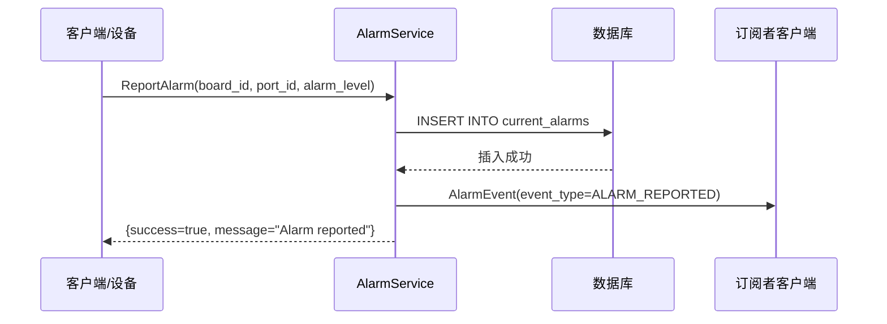
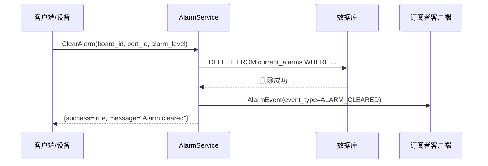
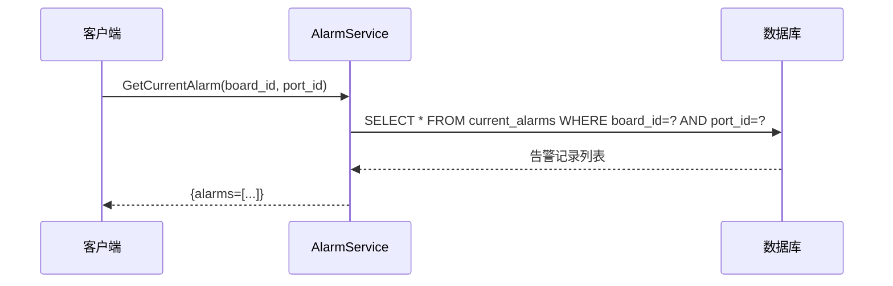
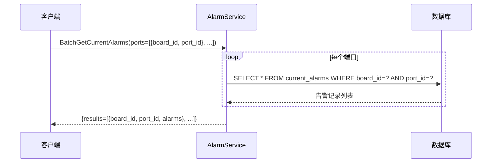
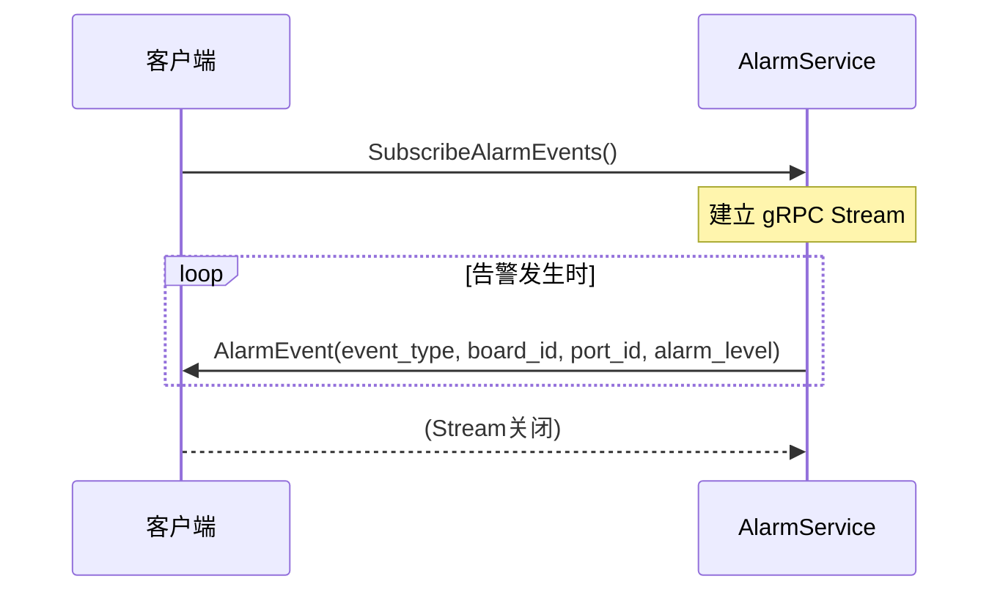
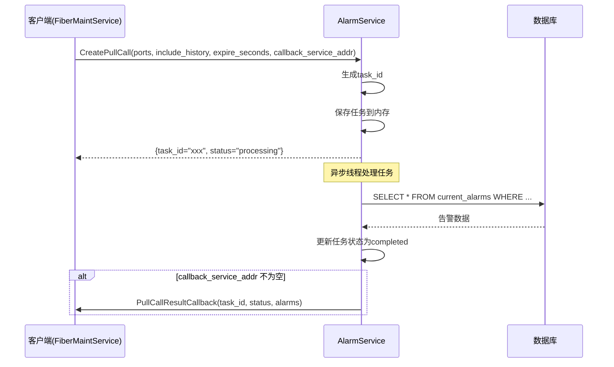
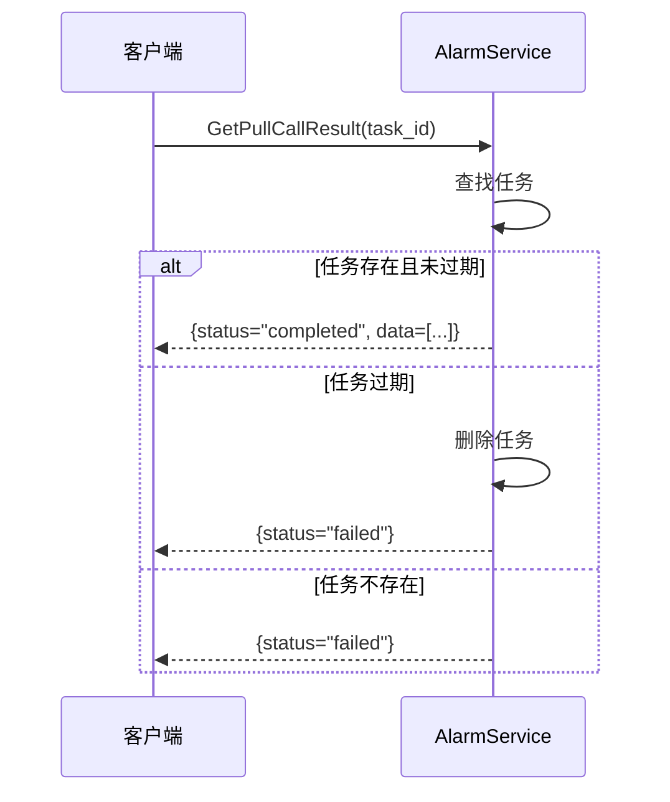
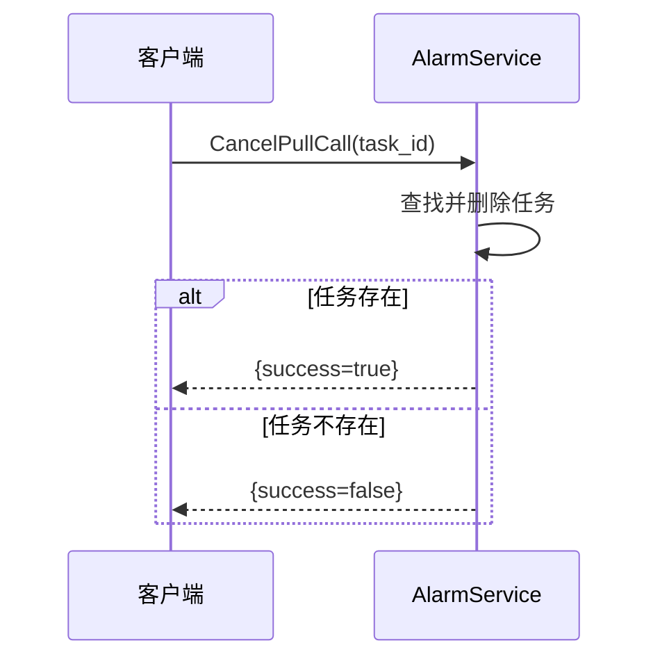
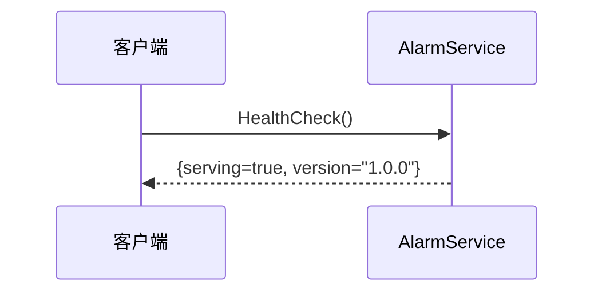
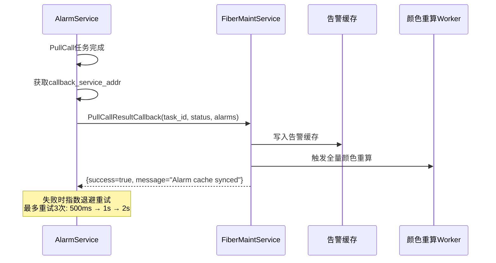

# AlarmService 功能时序图

---

## 1. 上报告警 (ReportAlarm)

---

## 2. 清除告警 (ClearAlarm)

---

## 3. 获取当前告警 (GetCurrentAlarm)

---

## 4. 批量获取当前告警 (BatchGetCurrentAlarms)

---

## 5. 订阅告警事件 (SubscribeAlarmEvents)

---

## 6. 创建PullCall任务 (CreatePullCall)

---

## 7. 获取PullCall结果 (GetPullCallResult)

---

## 8. 取消PullCall任务 (CancelPullCall)

---

## 9. 健康检查 (HealthCheck)

---

## 10. 主动回调 (PullCallResultCallback)

---

## 功能列表

| 功能 | RPC方法 | 说明 |
|------|---------|------|
| 上报告警 | `ReportAlarm` | 设备上报端口告警 |
| 清除告警 | `ClearAlarm` | 设备清除端口告警 |
| 获取当前告警 | `GetCurrentAlarm` | 查询指定端口的当前告警 |
| 批量获取告警 | `BatchGetCurrentAlarms` | 批量查询多个端口的告警 |
| 订阅告警事件 | `SubscribeAlarmEvents` | gRPC Stream实时推送告警事件 |
| 创建PullCall | `CreatePullCall` | 异步拉取告警数据，支持回调 |
| 获取PullCall结果 | `GetPullCallResult` | 查询PullCall任务结果 |
| 取消PullCall | `CancelPullCall` | 取消PullCall任务 |
| 主动回调 | `PullCallResultCallback` | AlarmService主动回调FiberMaintService |
| 健康检查 | `HealthCheck` | 服务健康状态检查 |