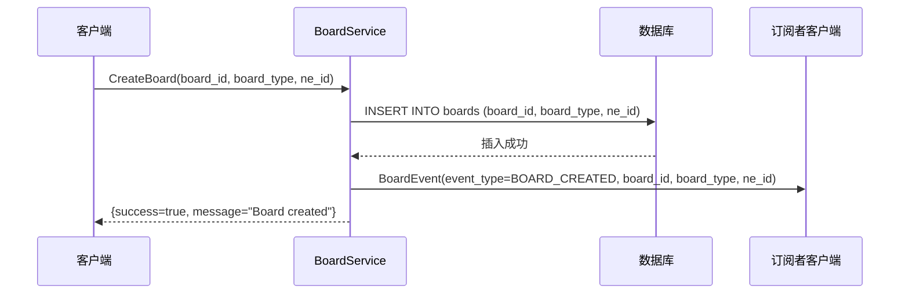
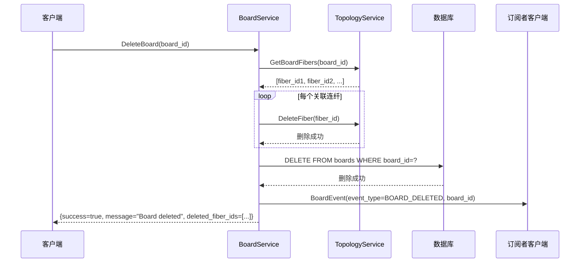
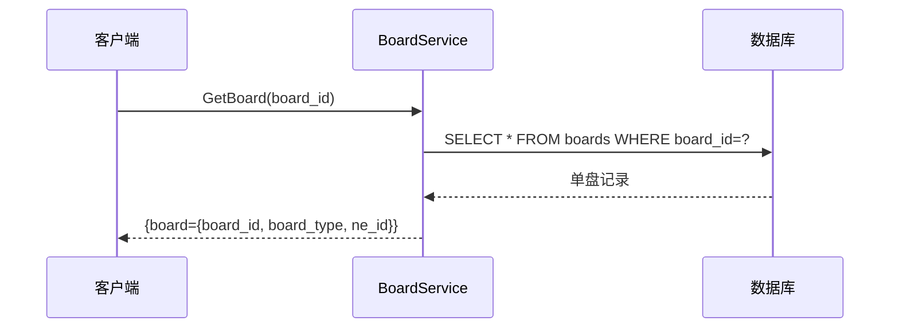
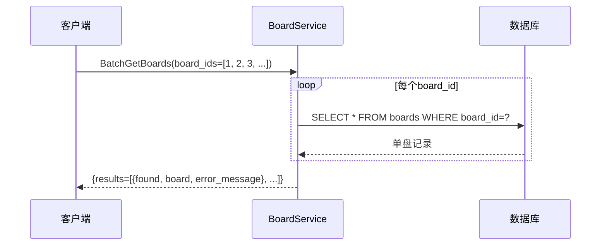
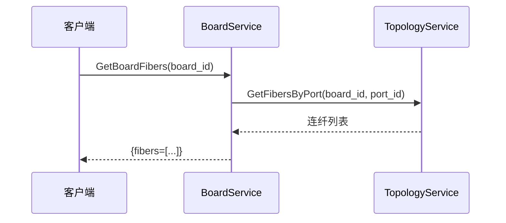
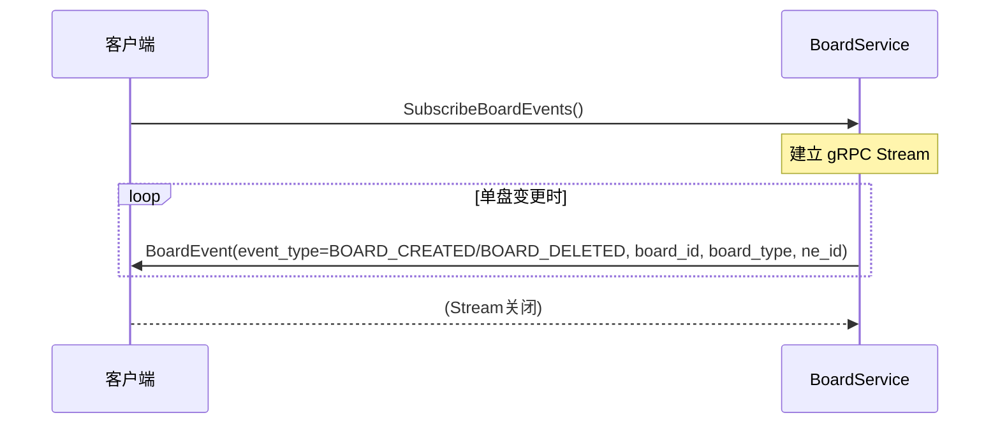
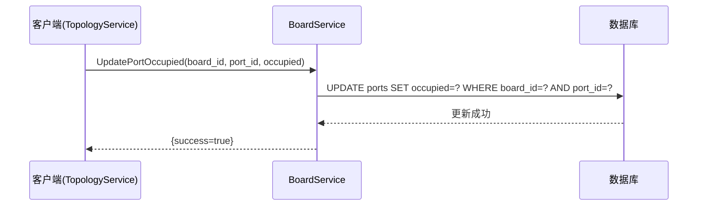
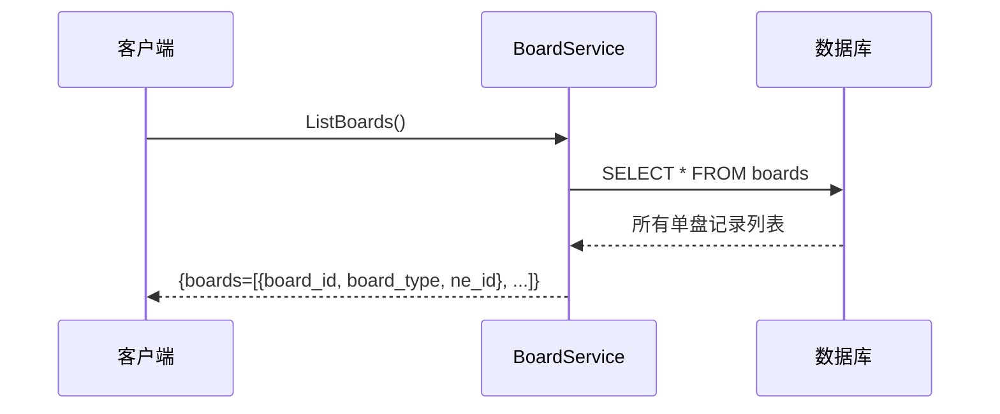
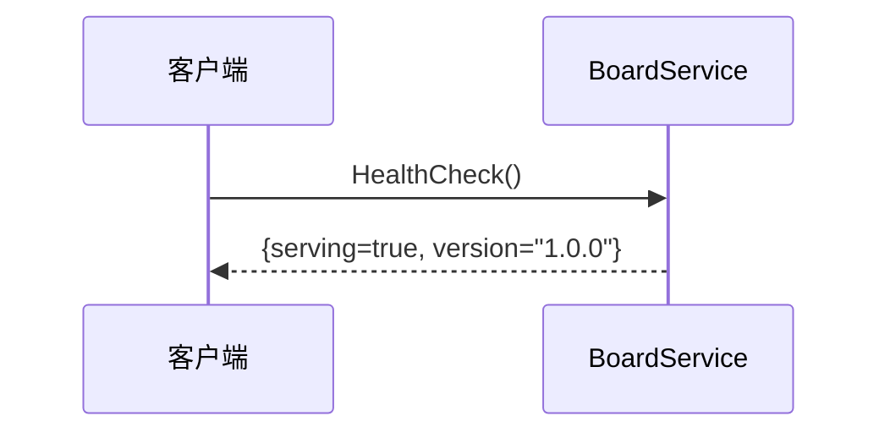

# BoardService 功能时序图

---

## 1. 创建单盘 (CreateBoard)

---

## 2. 删除单盘 (DeleteBoard)

---

## 3. 获取单盘信息 (GetBoard)

---

## 4. 批量获取单盘 (BatchGetBoards)

---

## 5. 获取单盘连纤 (GetBoardFibers)

---

## 6. 订阅单盘事件 (SubscribeBoardEvents)

---

## 7. 更新端口占用状态 (UpdatePortOccupied)

---

## 8. 获取所有单盘 (ListBoards)

---

## 9. 健康检查 (HealthCheck)

---

## 功能列表

| 功能 | RPC方法 | 说明 |
|------|---------|------|
| 创建单盘 | `CreateBoard` | 创建新的设备单盘 |
| 删除单盘 | `DeleteBoard` | 删除指定单盘，级联删除关联连纤 |
| 获取单盘 | `GetBoard` | 查询单盘详情 |
| 批量获取单盘 | `BatchGetBoards` | 批量查询多个单盘 |
| 获取所有单盘 | `ListBoards` | 获取所有单盘列表 |
| 获取单盘连纤 | `GetBoardFibers` | 查询单盘关联的所有连纤 |
| 订阅单盘事件 | `SubscribeBoardEvents` | gRPC Stream实时推送单盘变更事件 |
| 更新端口占用 | `UpdatePortOccupied` | 更新端口占用状态 |
| 健康检查 | `HealthCheck` | 服务健康状态检查 |