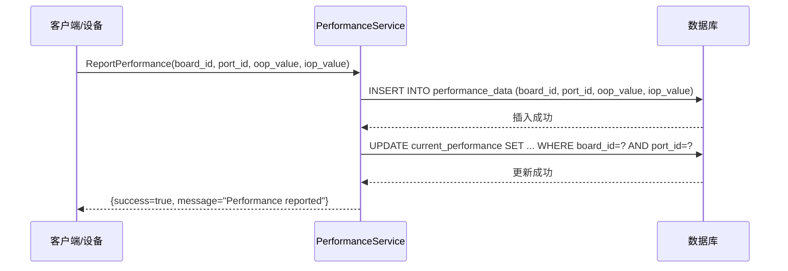
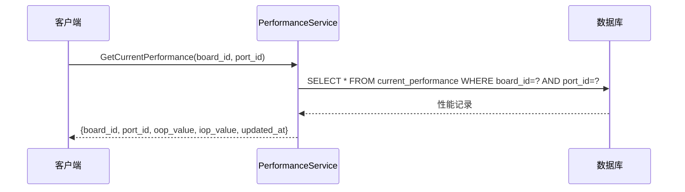
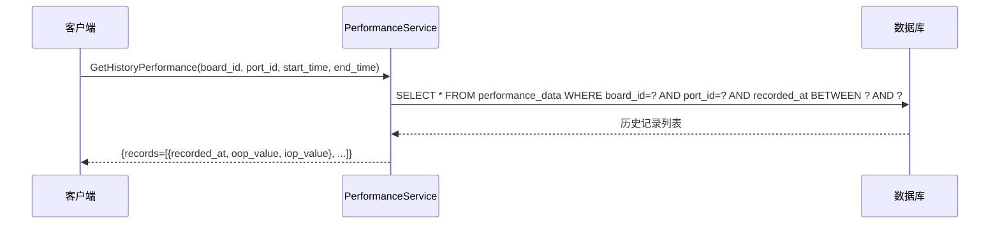
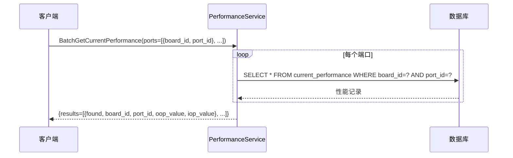
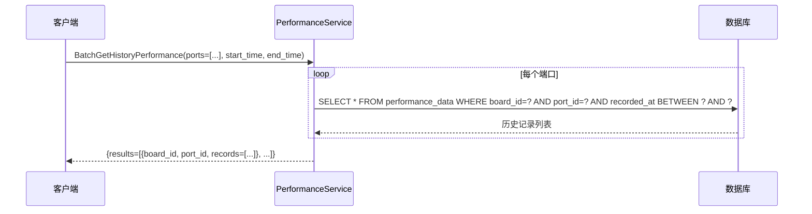
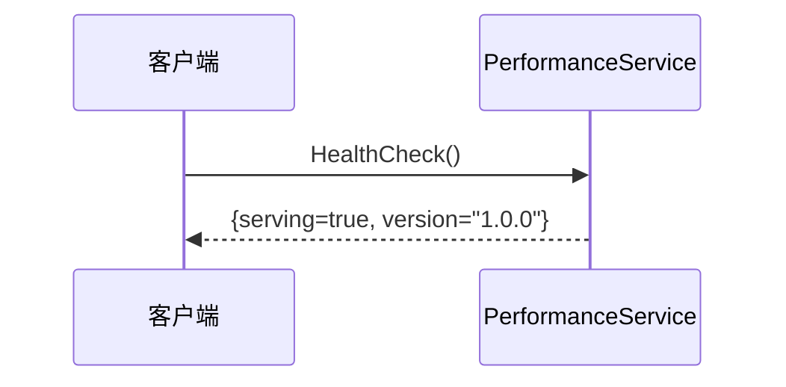

# PerformanceService 功能时序图

---

## 1. 上报性能数据 (ReportPerformance)

---

## 2. 获取当前性能 (GetCurrentPerformance)

---

## 3. 获取历史性能 (GetHistoryPerformance)

---

## 4. 批量获取当前性能 (BatchGetCurrentPerformance)

---

## 5. 批量获取历史性能 (BatchGetHistoryPerformance)

---

## 6. 健康检查 (HealthCheck)

---

## 功能列表

| 功能 | RPC方法 | 说明 |
|------|---------|------|
| 上报性能 | `ReportPerformance` | 设备上报端口性能数据(OOP/IOP) |
| 获取当前性能 | `GetCurrentPerformance` | 查询指定端口当前性能 |
| 获取历史性能 | `GetHistoryPerformance` | 查询指定端口历史性能趋势 |
| 批量获取当前性能 | `BatchGetCurrentPerformance` | 批量查询多个端口当前性能 |
| 批量获取历史性能 | `BatchGetHistoryPerformance` | 批量查询多个端口历史性能 |
| 健康检查 | `HealthCheck` | 服务健康状态检查 |