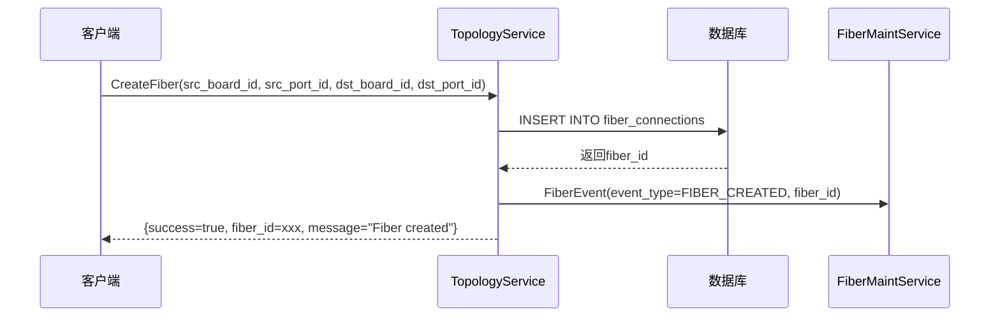
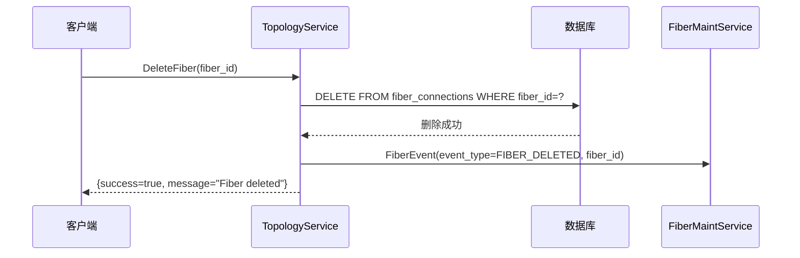
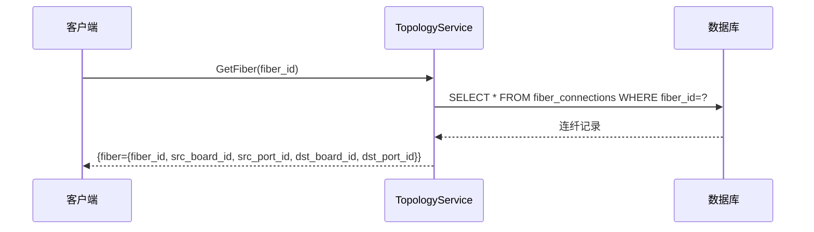
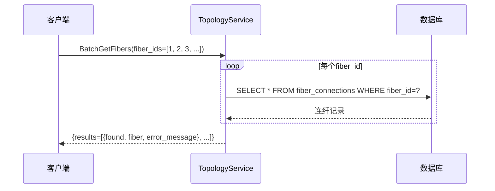
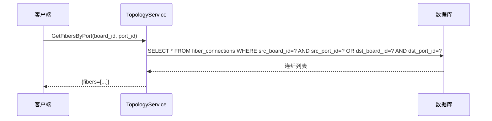
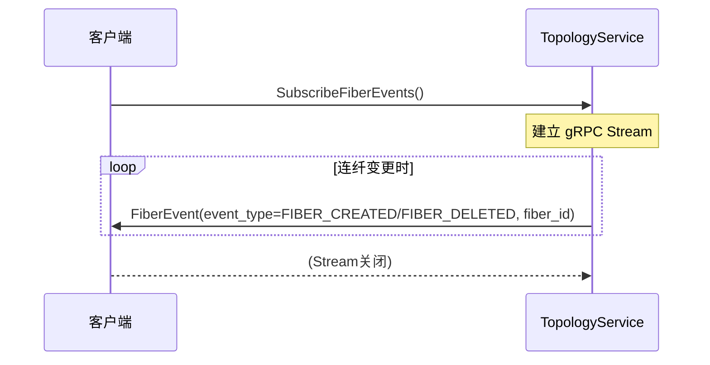
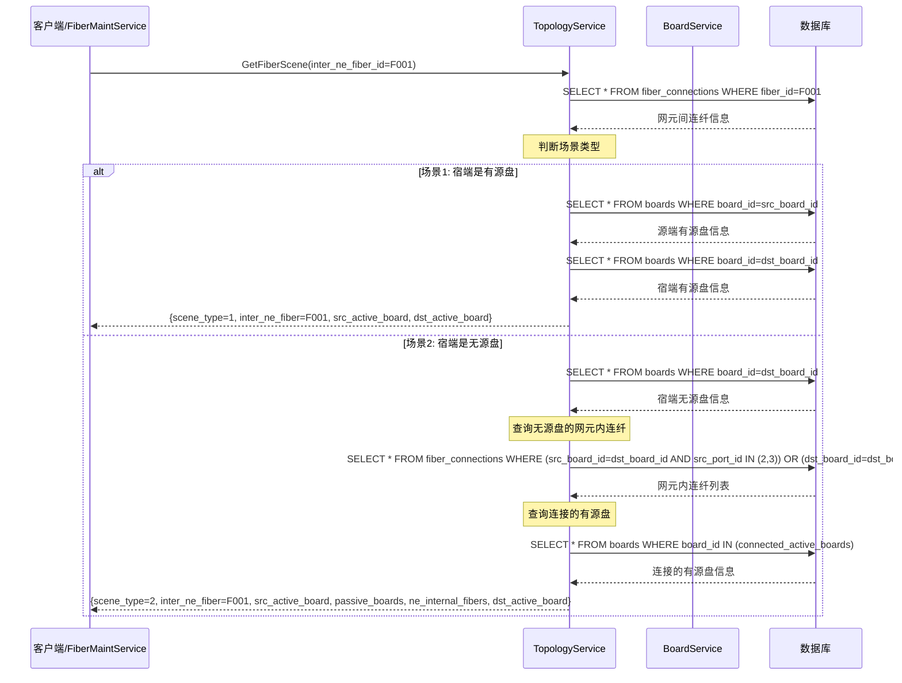
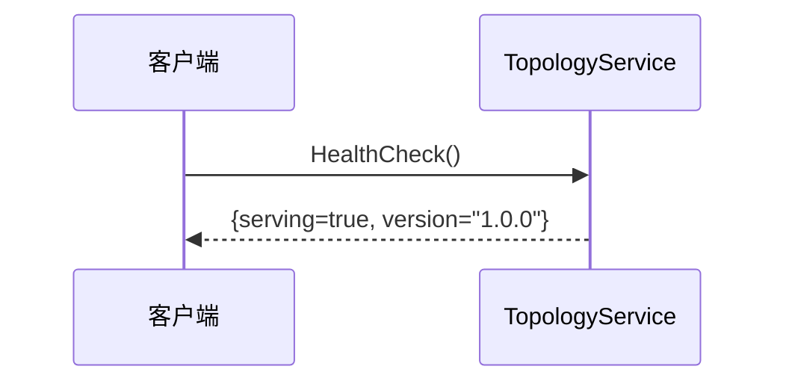

# TopologyService 功能时序图

---

## 1. 创建连纤 (CreateFiber)

---

## 2. 删除连纤 (DeleteFiber)

---

## 3. 获取连纤信息 (GetFiber)

---

## 4. 批量获取连纤 (BatchGetFibers)

---

## 5. 按端口获取连纤 (GetFibersByPort)

---

## 6. 订阅连纤事件 (SubscribeFiberEvents)

---

## 7. 获取连纤场景信息 (GetFiberScene)

---

## 8. 健康检查 (HealthCheck)

---

## 功能列表

| 功能 | RPC方法 | 说明 |
|------|---------|------|
| 创建连纤 | `CreateFiber` | 创建新的连纤连接 |
| 删除连纤 | `DeleteFiber` | 删除指定连纤 |
| 获取连纤 | `GetFiber` | 查询单条连纤详情 |
| 批量获取连纤 | `BatchGetFibers` | 批量查询多条连纤 |
| 按端口查询 | `GetFibersByPort` | 查询指定端口的所有连纤 |
| 获取连纤场景 | `GetFiberScene` | 获取网元间连纤的完整场景信息(包含有源盘、无源盘、网元内连纤) |
| 订阅连纤事件 | `SubscribeFiberEvents` | gRPC Stream实时推送连纤变更事件 |
| 健康检查 | `HealthCheck` | 服务健康状态检查 |