# 光纤维护服务完整时序图

## 文档概述

本文档基于 `需求.md`，绘制 FiberMaintService 所有功能的时序图，场景1与场景2分开描述。

---

## 告警消息处理流程图

### 整体处理流程

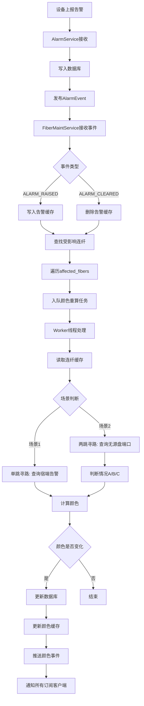

### 告警缓存处理流程

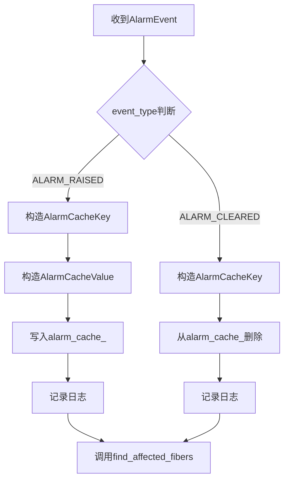

### 受影响连纤查找流程

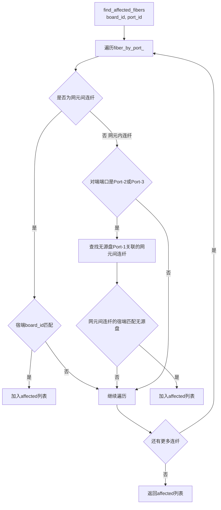

### 颜色计算决策流程

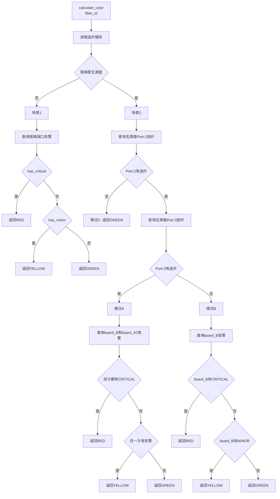

### 颜色更新与事件推送流程

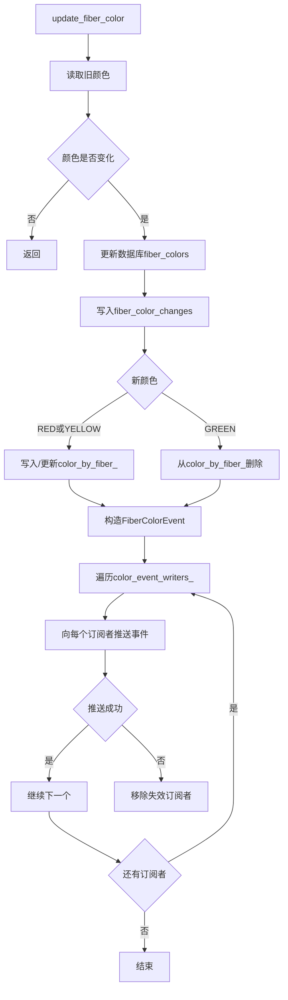

---

## 场景1：直连有源盘（网元间连纤）

### 场景1拓扑结构

```
┌── 网元 NE-A ──┐                    ┌── 网元 NE-B ──┐
│ [有源盘 A]   │    连纤 F001       │  [有源盘 B]   │
│  ne_id=100   │    (网元间)        │   ne_id=200   │
│  Port-1 ─────┼────────────────────┼─── Port-1     │
└───────────────┘                    └───────────────┘
```

### 1.1 服务启动初始化（异步模式）

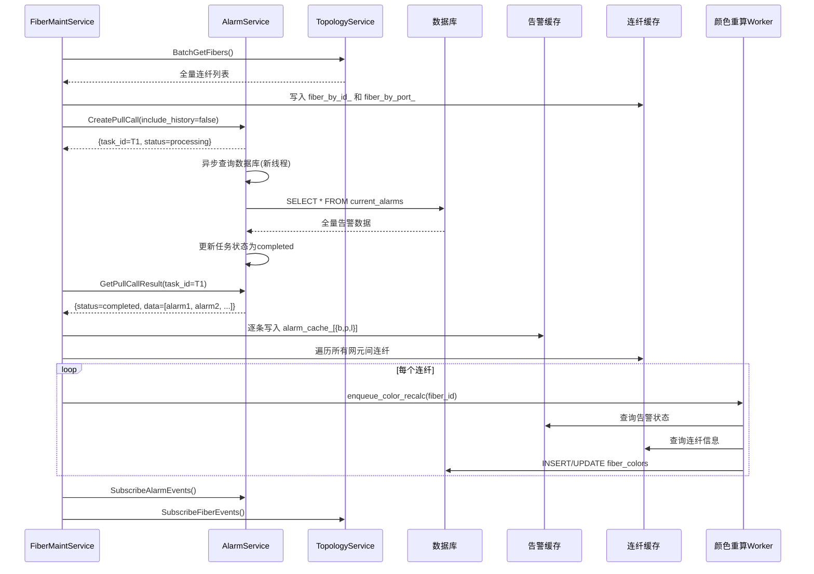

**流程说明**：

1. **先同步连纤缓存**：FiberMaintService 首先调用 TopologyService 获取全量连纤信息，写入本地缓存
2. **异步拉取告警**：创建 PullCall 任务后立即返回，AlarmService 在后台线程中异步查询数据库
3. **轮询获取结果**：FiberMaintService 定期轮询 PullCall 结果，不阻塞主线程
4. **实时颜色重算**：获取告警数据后，逐条更新告警缓存并触发颜色重算任务，Worker 线程并行处理，不等待所有计算完成

### 1.2 宿端有源盘B产生告警

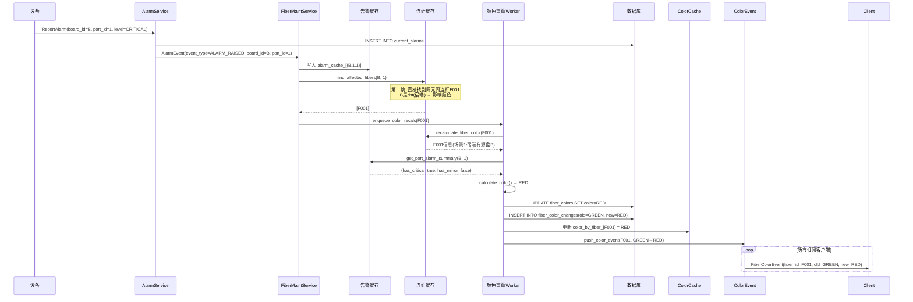

### 1.3 宿端有源盘B清除告警

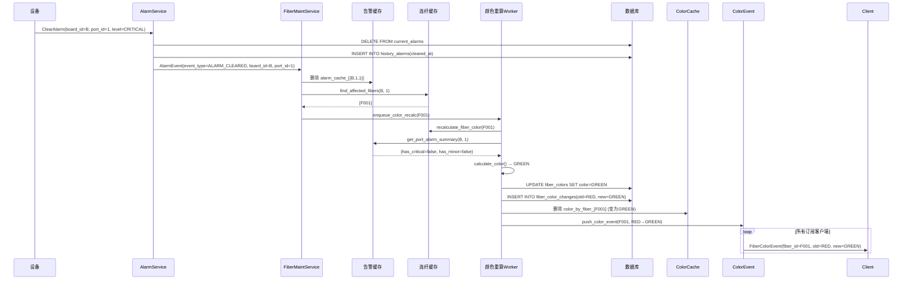

### 1.4 查询网元间连纤当前性能

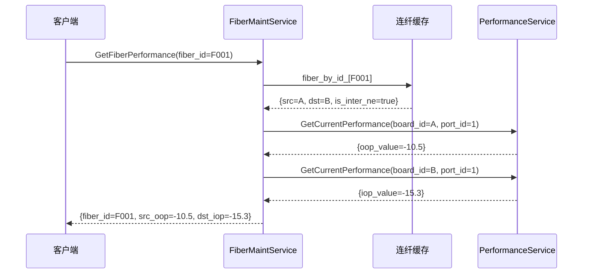

### 1.5 查询网元间连纤当前衰耗

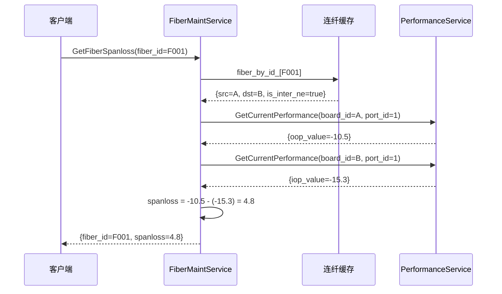

### 1.6 查询网元间连纤历史性能

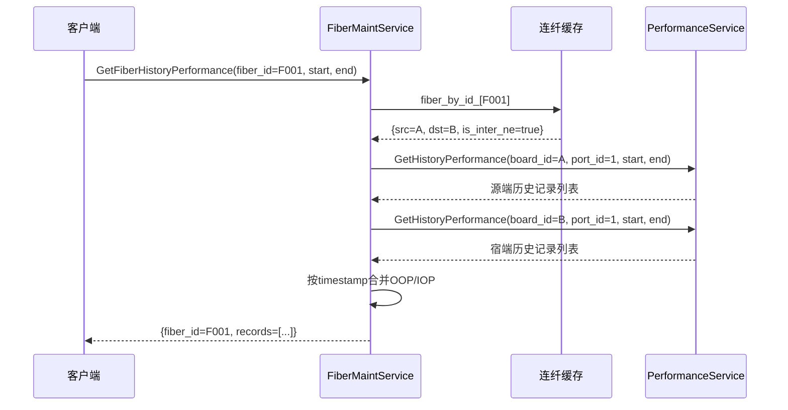

### 1.7 删除宿端有源盘B

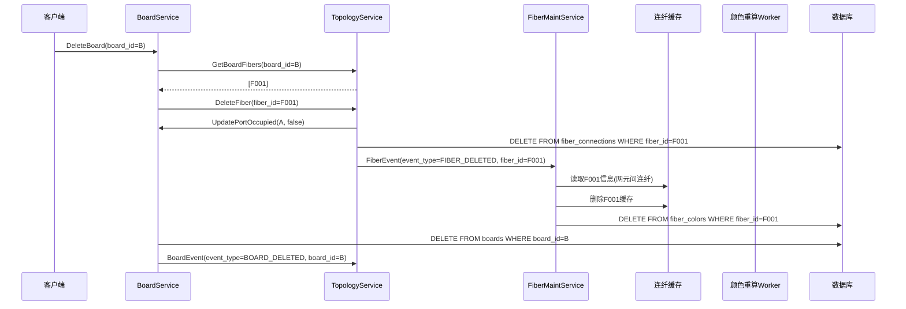

---

## 场景2：经由无源盘连接（网元间连纤）

### 场景2拓扑结构

```
┌──────── 网元 NE-A ────────┐              ┌──────── 网元 NE-B ────────┐
│ [有源盘 A]   [源无源盘 C] │              │ [宿无源盘 D]   [有源盘 B] │
│ ne_id=100    ne_id=100    │              │ ne_id=200     ne_id=200   │
│  Port-1 ──── Port-2(主)   │              │  Port-3(辅)── Port-1      │
│             Port-3(辅)    │              │  Port-2(主)               │
│             Port-1(网元间)─┼──────────────┼── Port-1(网元间)         │
│                          │   连纤 F001  │                            │
│  网元内连纤:             │              │  网元内连纤:               │
│  A.Port-1 ←→ C.Port-2   │              │  D.Port-2 ←→ B.Port-1    │ (F002)
│                          │              │  D.Port-3 ←→ A2.Port-1    │ (F003)
└──────────────────────────┘              └────────────────────────────┘
```

### 2.1 宿端有源盘B产生告警（两跳寻路）

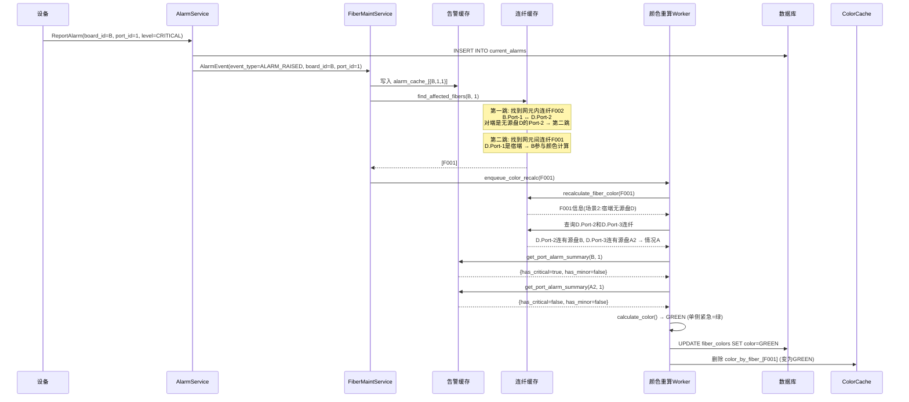

### 2.2 宿端有源盘A2产生告警（两跳寻路）

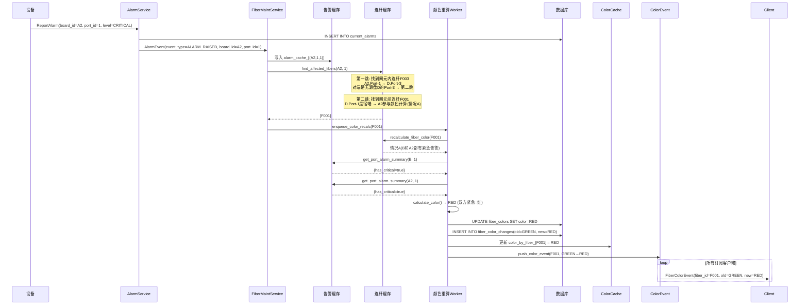

### 2.3 删除宿端无源盘Port-3关联的连纤（情况A→情况B）

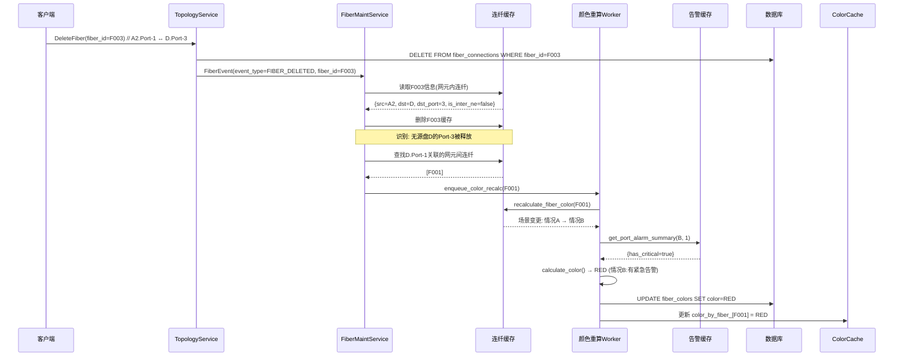

### 2.4 删除宿端无源盘Port-2关联的连纤（情况B→情况C）

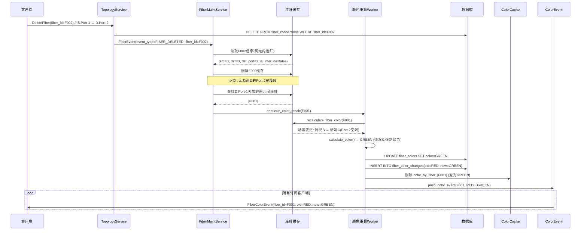

### 2.5 查询场景2网元间连纤当前性能

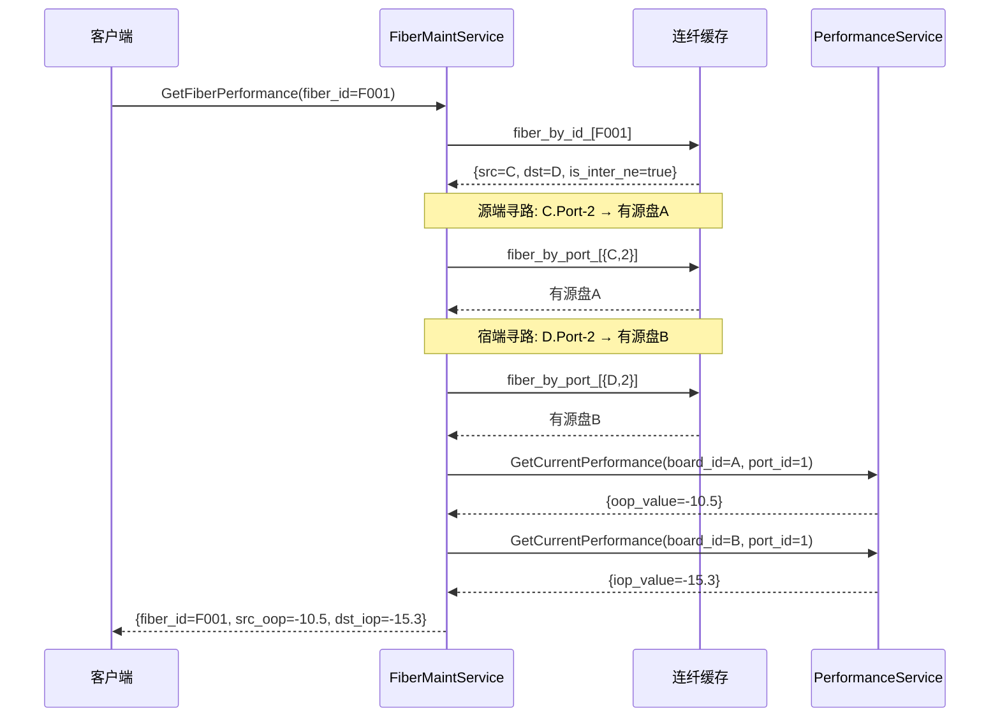

### 2.6 查询场景2网元间连纤当前衰耗

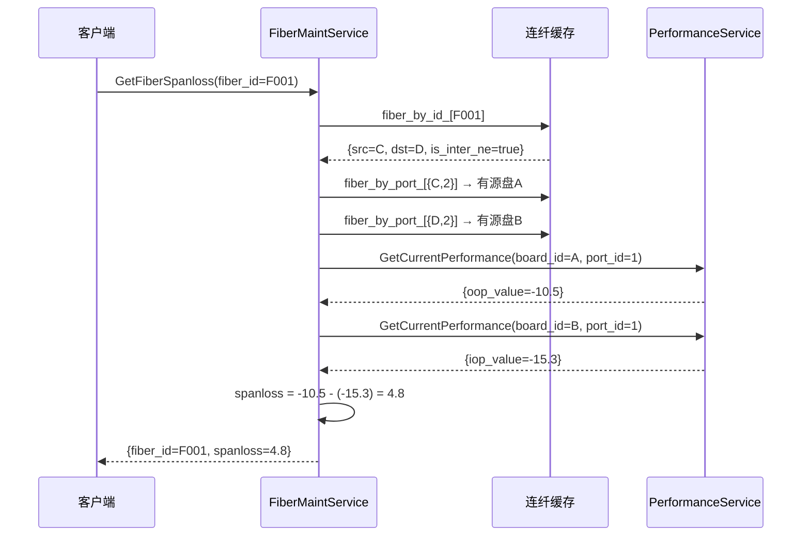

### 2.7 删除宿端单盘B（完整事件链路）

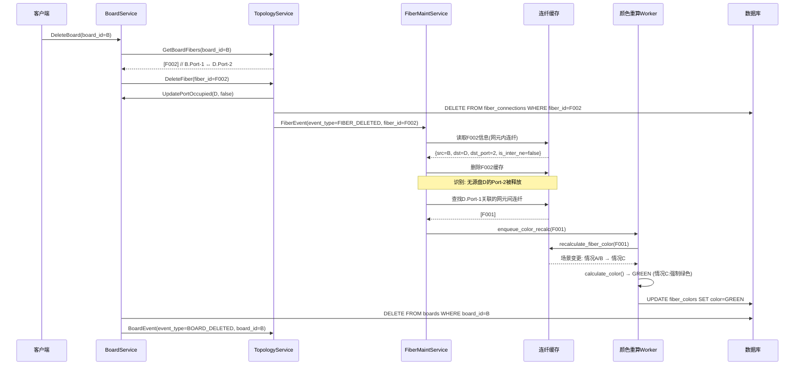

### 2.8 创建网元内连纤（情况C→情况B/A）

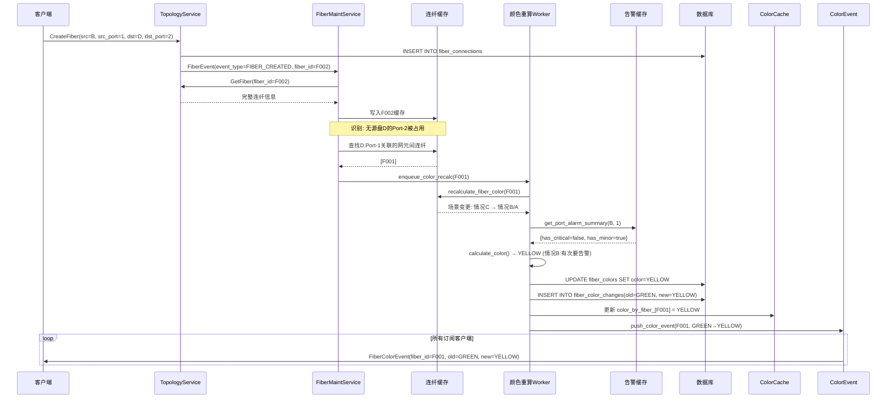

---

## 公共功能时序图

### 3.1 获取有颜色连纤（从缓存读取）

```mermaid
sequenceDiagram
    participant Client as 客户端
    participant FiberMaint as FiberMaintService
    participant ColorCache as 颜色缓存
    participant FiberCache as 连纤缓存

    Client->>FiberMaint: GetColoredFibers(color=RED)
  
    FiberMaint->>ColorCache: 遍历 color_by_fiber_
    ColorCache-->>FiberMaint: 红色连纤fiber_id列表
  
    loop 每个红色连纤
        FiberMaint->>FiberCache: fiber_by_id_[fiber_id]
        FiberCache-->>FiberMaint: 连纤详细信息
    end
  
    FiberMaint-->>Client: {colors=[...]}
```

### 3.2 PullCall主动回调

```mermaid
sequenceDiagram
    participant AlarmService as AlarmService
    participant FiberMaint as FiberMaintService
    participant AlarmCache as 告警缓存
    participant Worker as 颜色重算Worker
    participant DB as 数据库

    AlarmService->>AlarmService: PullCall任务完成
    AlarmService->>AlarmService: 获取callback_service_addr
  
    AlarmService->>FiberMaint: PullCallResultCallback(task_id, status, alarms)
  
    FiberMaint->>AlarmCache: 写入告警缓存
    FiberMaint->>Worker: 触发全量颜色重算 full_color_recalc()
  
    Worker->>FiberCache: 遍历所有网元间连纤
    loop 每个连纤
        Worker->>AlarmCache: 查询告警状态
        Worker->>Worker: calculate_color()
        Worker->>DB: UPDATE fiber_colors
    end
  
    FiberMaint-->>AlarmService: {success=true}
  
    Note over AlarmService: 失败时指数退避重试<br/>最多重试3次: 500ms → 1s → 2s
```

### 3.3 获取所有有颜色连纤（从缓存读取）

```mermaid
sequenceDiagram
    participant Client as 客户端
    participant FiberMaint as FiberMaintService
    participant ColorCache as 颜色缓存
    participant FiberCache as 连纤缓存

    Client->>FiberMaint: GetAllColoredFibers()
  
    FiberMaint->>ColorCache: 遍历 color_by_fiber_（仅RED/YELLOW）
    ColorCache-->>FiberMaint: 红/黄连纤fiber_id列表
  
    loop 每个有颜色连纤
        FiberMaint->>FiberCache: fiber_by_id_[fiber_id]
        FiberCache-->>FiberMaint: 连纤详细信息
    end
  
    FiberMaint-->>Client: {colors=[...]}
```

### 3.3 获取实时统计（从缓存读取）

```mermaid
sequenceDiagram
    participant Client as 客户端
    participant FiberMaint as FiberMaintService
    participant ColorCache as 颜色缓存

    Client->>FiberMaint: GetFiberStatsRealtime()
  
    FiberMaint->>ColorCache: 遍历 color_by_fiber_ 统计
    ColorCache-->>FiberMaint: {red_count=5, yellow_count=3}
  
    FiberMaint-->>Client: {red_count=5, yellow_count=3, total_colored=8}
```

### 3.4 订阅连纤颜色变化

```mermaid
sequenceDiagram
    participant Client as 客户端
    participant FiberMaint as FiberMaintService
    participant WriterList as 订阅者列表

    Client->>FiberMaint: SubscribeFiberColorEvents()
    FiberMaint->>WriterList: 添加 writer 到 color_event_writers_
  
    Note over Client,FiberMaint: 长连接保持，等待颜色变化事件
  
    loop 当连纤颜色变化时
        FiberMaint->>Client: FiberColorEvent(fiber_id, fiber_info, old_color, new_color)
    end
  
    Client->>FiberMaint: 关闭连接
    FiberMaint->>WriterList: 从 color_event_writers_ 移除
```

### 3.5 获取趋势统计

```mermaid
sequenceDiagram
    participant Client as 客户端
    participant FiberMaint as FiberMaintService
    participant DB as 数据库

    Client->>FiberMaint: GetFiberStatsTrend(start_time, end_time)
  
    FiberMaint->>DB: SELECT * FROM fiber_stats_trend WHERE timestamp BETWEEN start AND end
  
    DB-->>FiberMaint: 趋势数据列表
  
    FiberMaint-->>Client: {trends=[...]}
```

### 3.5 5分钟定时趋势采集

```mermaid
sequenceDiagram
    participant Worker as TrendWorker
    participant FiberMaint as FiberMaintService
    participant ColorCache as 颜色缓存
    participant DB as 数据库

    loop 每5分钟
        Worker->>ColorCache: 遍历 color_by_fiber_ 统计 RED/YELLOW 数量
        ColorCache-->>Worker: {red_count, yellow_count, total_colored}
      
        Worker->>DB: INSERT INTO fiber_stats_trend (timestamp, red_count, yellow_count, total_colored)<br/>VALUES (NOW(), red_count, yellow_count, total_colored)
        DB-->>Worker: 插入成功
    end
```

### 3.7 健康检查

```mermaid
sequenceDiagram
    participant Client as 客户端
    participant FiberMaint as FiberMaintService

    Client->>FiberMaint: HealthCheck()
  
    FiberMaint-->>Client: {serving=true, version="1.0.0"}
```

---

## 需求验证对照表

### 场景1验证

| 需求点               | 验证结果 | 说明                             |
| -------------------- | -------- | -------------------------------- |
| 告警消息触发颜色重算 | ✅ 通过  | `process_alarm_event()`        |
| 单跳寻路             | ✅ 通过  | `find_affected_fibers()`       |
| 仅宿端影响颜色       | ✅ 通过  | 判断`dst_board_id == board_id` |
| 场景1颜色规则        | ✅ 通过  | `calculate_color()`            |
| 性能查询             | ✅ 通过  | `GetFiberPerformance()`        |
| 衰耗计算             | ✅ 通过  | `GetFiberSpanloss()`           |
| 历史性能查询         | ✅ 通过  | `GetFiberHistoryPerformance()` |
| 颜色变化推送         | ✅ 通过  | `push_color_event()`           |

### 场景2验证

| 需求点                 | 验证结果 | 说明                                       |
| ---------------------- | -------- | ------------------------------------------ |
| 两跳寻路               | ✅ 通过  | `find_affected_fibers()`                 |
| 情况A颜色规则          | ✅ 通过  | 双方紧急=红，单侧紧急=绿                   |
| 情况B颜色规则          | ✅ 通过  | 仅看Port-2有源盘告警                       |
| 情况C强制绿色          | ✅ 通过  | Port-2空闲时强制绿色                       |
| 网元内连纤删除触发重算 | ✅ 通过  | **已修复** `process_fiber_event()` |
| Port-2删除→情况C      | ✅ 通过  | **已修复**                           |
| Port-3删除→情况B      | ✅ 通过  | **已修复**                           |
| 网元内连纤创建触发重算 | ✅ 通过  | `process_fiber_event()`                  |
| 性能查询Port-2寻路     | ✅ 通过  | `GetFiberPerformance()`                  |
| 衰耗计算Port-2寻路     | ✅ 通过  | `GetFiberSpanloss()`                     |
| 颜色变化推送           | ✅ 通过  | `push_color_event()`                     |

### 公共功能验证

| 需求点         | 验证结果 | 说明                                                 |
| -------------- | -------- | ---------------------------------------------------- |
| 有颜色连纤查询 | ✅ 通过  | `GetColoredFibers()`（从缓存读取）                 |
| 所有有颜色连纤 | ✅ 通过  | `GetAllColoredFibers()`（从缓存读取）              |
| 实时统计       | ✅ 通过  | `GetFiberStatsRealtime()`（从缓存读取）            |
| 趋势统计       | ✅ 通过  | `GetFiberStatsTrend()`                             |
| 5分钟定时采集  | ✅ 通过  | `trend_task()`                                     |
| 健康检查       | ✅ 通过  | `HealthCheck()`                                    |
| 启动全量同步   | ✅ 通过  | `sync_alarm_cache()` + `sync_fiber_cache()`      |
| 颜色缓存       | ✅ 通过  | `color_by_fiber_`（仅缓存RED/YELLOW）              |
| 颜色事件订阅   | ✅ 通过  | `SubscribeFiberColorEvents()`（gRPC Stream）       |
| 主动回调模式   | ✅ 通过  | `PullCallResultCallback()`（AlarmService主动回调） |
| 订阅者管理优化 | ✅ 通过  | `std::vector` 替代 `std::list`                   |

---

## 修复记录

### 修复项：网元内连纤删除未触发颜色重算

**问题位置**：[fiber_maint_service_impl.cpp](file:///e:/Work/FiberMaintain/Services/fiber_maint_service/fiber_maint_service_impl.cpp#L213-L326)

**修复内容**：在 `process_fiber_event()` 的 FIBER_DELETED 处理逻辑中，增加了网元内连纤删除的场景变更检测：

1. 识别被删连纤连接的是无源盘的哪个端口（Port-2/Port-3）
2. 查找该无源盘Port-1关联的网元间连纤
3. 触发颜色重算

**修复后行为**：

| 删除类型                | 场景变更         | 颜色影响        |
| ----------------------- | ---------------- | --------------- |
| 有源盘 ↔ 无源盘 Port-2 | 情况A/B → 情况C | 强制变绿        |
| 有源盘 ↔ 无源盘 Port-3 | 情况A → 情况B   | 按情况B规则重算 |
