# 告警处理优化方案

## 文档概述

本文档针对光纤维护服务处理海量告警消息的场景，分析当前实现存在的问题，并提出优化方案。优化目标包括：

1. 保证告警事件按时间顺序处理，避免乱序导致的颜色计算错误
2. 减少不必要的颜色更新和事件推送
3. 提高系统处理海量告警的能力

---

## 一、当前实现分析

### 1.1 告警处理流程

当前告警处理流程如下：

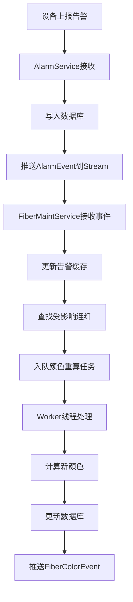

### 1.2 当前实现的核心代码

**告警事件处理**（`fiber_maint_service_impl.cpp` 第248-269行）：

```cpp
void FiberMaintServiceImpl::process_alarm_event(const fiber::alarm::AlarmEvent& event) {
    {
        std::lock_guard<std::mutex> lock(alarm_cache_mutex_);
        AlarmCacheKey key = {event.board_id(), event.port_id(), event.alarm_level()};
      
        if (event.event_type() == fiber::common::AlarmEventType::ALARM_RAISED) {
            AlarmCacheValue value = {event.timestamp()};
            alarm_cache_[key] = value;
        } else {
            alarm_cache_.erase(key);
        }
    }
  
    std::vector<int32_t> affected_fibers = find_affected_fibers(event.board_id(), event.port_id());
  
    for (int32_t fiber_id : affected_fibers) {
        enqueue_color_recalc(fiber_id, [this, fiber_id]() {
            recalculate_fiber_color(fiber_id);
        });
    }
}
```

**颜色更新**（`fiber_maint_service_impl.cpp` 第679-699行）：

```cpp
void FiberMaintServiceImpl::update_fiber_color(int32_t fiber_id, int8_t new_color, int32_t scene_type, int32_t scenario_case) {
    int8_t old_color = fiber::common::FiberColor::GREEN;
    bool cached = false;
  
    {
        std::lock_guard<std::mutex> lock(color_cache_mutex_);
        auto it = color_by_fiber_.find(fiber_id);
        if (it != color_by_fiber_.end()) {
            old_color = it->second.color;
            cached = true;
        }
    }
  
    auto conn = DBConnectionPool::instance().get_connection();
    if (!conn) return;
  
    char sql[256];
    sprintf(sql, "UPDATE fiber_colors SET color = %d, scene_type = %d, scenario_case = %d WHERE fiber_id = %d",
            new_color, scene_type, scenario_case, fiber_id);
  
    if (mysql_query(conn.get(), sql) != 0) {
        // ... 错误处理
    }
}
```

### 1.3 存在的问题

| 问题               | 描述                                       | 影响                                                     |
| ------------------ | ------------------------------------------ | -------------------------------------------------------- |
| **乱序处理** | gRPC Stream推送事件可能因网络延迟导致乱序  | 告警产生→清除的顺序可能变成清除→产生，导致颜色计算错误 |
| **重复计算** | 每次告警事件都触发颜色重算，即使颜色未变化 | 浪费CPU资源，增加数据库压力                              |
| **频繁推送** | 颜色变化时立即推送事件，未考虑批量优化     | 网络带宽消耗大，客户端处理压力大                         |
| **任务堆积** | 海量告警同时到达时，任务队列可能堆积       | 内存占用增加，响应延迟增大                               |
| **锁竞争**   | 更新缓存和查找受影响连纤都需要加锁         | 并发性能受限                                             |

### 1.4 代码级问题发现

**问题**：当前 `update_fiber_color` 函数（第696行）在读取旧颜色后，无论新旧颜色是否相同，都会执行 UPDATE SQL 语句。

**影响**：即使颜色未变化，也会产生数据库写操作，增加数据库压力。

**优化机会**：在执行 UPDATE 前增加颜色变化检测，只有颜色真正变化时才执行数据库操作。

---

## 二、优化方案设计

### 2.1 方案概述

针对上述问题，提出以下优化策略：

1. **事件时序保证**：引入水印（Watermark）机制，等待一段时间窗口后再处理事件，确保乱序事件有机会到达
2. **颜色变化检测**：在颜色重算后检查是否真的变化，只有变化时才更新数据库和推送事件
3. **事件去重合并**：同一端口同级别告警的重复事件进行去重和合并（注意：产生→清除必须按顺序处理）
4. **批量处理**：对颜色重算任务进行批量合并，减少数据库操作
5. **延迟推送**：颜色变化事件采用延迟推送策略，减少网络传输

### 2.2 优化后的处理流程

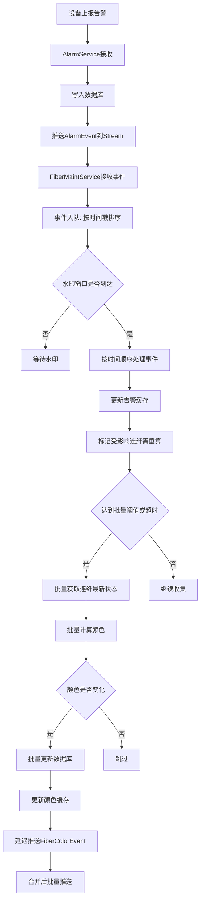

### 2.3 核心设计要点

#### 2.3.1 事件时序保证（水印机制）

**设计思路**：引入水印（Watermark）机制，事件到达后不立即处理，而是等待一个时间窗口（如200ms），让乱序事件有机会到达。

**核心概念**：

| 概念               | 说明                                     |
| ------------------ | ---------------------------------------- |
| **水印时间** | 当前已经确认可以安全处理的最晚事件时间戳 |
| **等待窗口** | 事件到达后需要等待的时间，默认200ms      |
| **无序度**   | 允许事件乱序到达的最大时间差             |

**处理逻辑**：

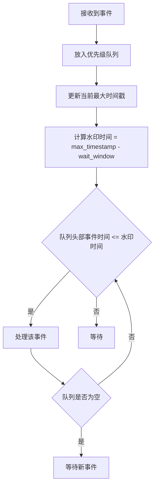

**算法描述**：

```
输入：告警事件流（可能乱序）
输出：按时间顺序处理的事件序列

步骤：
1. 初始化最小堆（优先级队列）和水印时间
2. 接收到事件时：
   a. 将事件放入优先级队列
   b. 更新当前最大时间戳 max_ts
   c. 计算水印时间 watermark = max_ts - wait_window
3. 检查队列头部事件：
   a. 如果事件时间戳 <= watermark，处理该事件
   b. 如果事件时间戳 > watermark，等待
4. 处理事件时更新告警缓存
5. 重复步骤3-4
```

**等待窗口配置**：

| 场景       | 等待窗口 | 说明                 |
| ---------- | -------- | -------------------- |
| 正常网络   | 200ms    | 平衡实时性和顺序保证 |
| 高延迟网络 | 500ms    | 确保乱序事件到达     |
| 本地测试   | 50ms     | 快速响应             |

#### 2.3.2 事件去重合并

**设计思路**：在事件入队前，检查是否存在相同端口和级别的未处理事件，进行去重合并。

**关键规则**：产生→清除必须按顺序处理，不能直接删除两个事件！

**去重合并规则**：

| 情况            | 已有事件      | 新事件        | 合并结果                           | 说明                                   |
| --------------- | ------------- | ------------- | ---------------------------------- | -------------------------------------- |
| 同级别产生+产生 | ALARM_RAISED  | ALARM_RAISED  | 保留最新时间戳的ALARM_RAISED       | 重复产生，以最新为准                   |
| 同级别清除+清除 | ALARM_CLEARED | ALARM_CLEARED | 保留最新时间戳的ALARM_CLEARED      | 重复清除，以最新为准                   |
| 产生后清除      | ALARM_RAISED  | ALARM_CLEARED | **保留两个事件，按顺序处理** | 必须先产生再清除，确保缓存最终状态正确 |
| 清除后产生      | ALARM_CLEARED | ALARM_RAISED  | 保留ALARM_RAISED                   | 先清除再产生是有效的新告警             |

**去重缓存结构**：

```
struct EventDedupKey {
    int32_t board_id;
    int32_t port_id;
    int32_t alarm_level;
};

std::unordered_map<EventDedupKey, TimedAlarmEvent> dedup_cache_;
```

**去重流程**：

```mermaid
flowchart TD
    A[接收到新事件] --> B{检查去重缓存}
    B -->|存在相同事件| C{事件类型是否相同}
    C -->|相同| D[更新时间戳]
    C -->|不同| E{新事件是产生还是清除}
    E -->|产生(RAISED)| F[加入队列，保留两个事件]
    E -->|清除(CLEARED)| G[加入队列，保留两个事件]
    B -->|不存在| H[加入队列]
    D --> H
    F --> H
    G --> H
```

#### 2.3.3 颜色变化检测

**设计思路**：在颜色重算后，比较新旧颜色是否相同，只有不同时才进行数据库更新和事件推送。

**检测流程**：

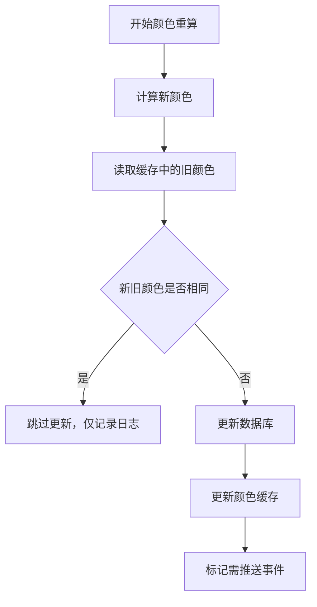

**优化点**：

- 颜色相同时，跳过数据库更新操作
- 颜色相同时，跳过事件推送操作
- 减少不必要的IO操作

**伪代码**：

```cpp
void update_fiber_color(int32_t fiber_id, int8_t new_color, int32_t scene_type, int32_t scenario_case) {
    int8_t old_color = fiber::common::FiberColor::GREEN;
    bool cached = false;
  
    {
        std::lock_guard<std::mutex> lock(color_cache_mutex_);
        auto it = color_by_fiber_.find(fiber_id);
        if (it != color_by_fiber_.end()) {
            old_color = it->second.color;
            cached = true;
        }
    }
  
    if (new_color == old_color) {
        Logger::instance().debug("Color unchanged for fiber {}, skip update", fiber_id);
        return;  // 颜色未变化，跳过更新
    }
  
    // 颜色变化，执行更新
    auto conn = DBConnectionPool::instance().get_connection();
    if (!conn) return;
  
    // ... 更新数据库和缓存
}
```

#### 2.3.4 批量处理

**设计思路**：将多个连纤的颜色重算任务合并为批量操作，减少数据库交互次数。

**批量策略**：

| 策略     | 触发条件                  | 说明                       |
| -------- | ------------------------- | -------------------------- |
| 数量阈值 | 累计达到N个连纤需重算     | 适合高并发场景             |
| 时间阈值 | 距离上次批量处理超过T毫秒 | 保证延迟敏感场景的响应速度 |
| 手动触发 | 系统空闲时主动触发        | 避免任务堆积               |

**批量处理流程**：

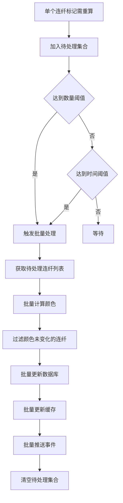

#### 2.3.5 延迟推送

**设计思路**：颜色变化事件采用延迟推送策略，在一段时间内收集多个事件后合并推送。

**延迟推送流程**：

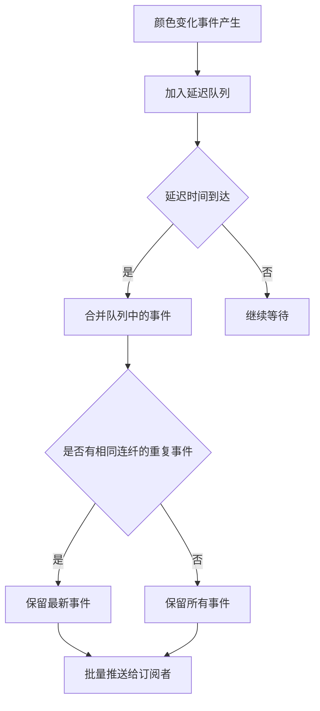

---

## 三、关键算法设计

### 3.1 水印排序算法

**算法名称**：基于水印的事件排序算法

**算法描述**：

```
输入：告警事件流（可能乱序）
输出：按时间顺序处理的事件序列

步骤：
1. 初始化最小堆（优先级队列）、水印时间、最大时间戳
2. 接收到事件时：
   a. 将事件放入优先级队列
   b. 更新最大时间戳 max_ts = max(max_ts, event.timestamp)
   c. 计算水印时间 watermark = max_ts - wait_window
3. 定时检查队列：
   a. 如果队列非空且队首事件时间 <= watermark：
      i. 取出队首事件
      ii. 检查事件是否已过期（被后续事件覆盖）
      iii. 如果未过期，处理事件
   b. 如果队首事件时间 > watermark，等待下次检查
4. 处理事件时更新告警缓存
```

**时间复杂度**：

- 入队：O(log N)
- 出队：O(log N)
- 水印检查：O(1)

**空间复杂度**：O(N)

### 3.2 颜色变化检测算法

**算法名称**：缓存优先的颜色变化检测

**算法描述**：

```
输入：连纤ID、计算得到的新颜色
输出：是否需要更新

步骤：
1. 从颜色缓存中读取旧颜色（默认GREEN）
2. 比较新旧颜色：
   a. 如果相同，返回false（不需要更新）
   b. 如果不同，返回true（需要更新）
3. 更新时：
   a. 如果新颜色是RED/YELLOW，写入缓存
   b. 如果新颜色是GREEN，从缓存删除
```

**优化点**：

- 优先从缓存读取，避免频繁数据库查询
- 只有颜色变化时才进行数据库操作

### 3.3 批量更新算法

**算法名称**：合并写的批量颜色更新

**算法描述**：

```
输入：待更新的连纤颜色列表
输出：批量更新结果

步骤：
1. 将连纤按颜色变化类型分类：
   a. GREEN -> RED/YELLOW（新增）
   b. RED/YELLOW -> RED/YELLOW（更新）
   c. RED/YELLOW -> GREEN（删除）
2. 过滤颜色未变化的连纤
3. 构造批量SQL语句：
   a. INSERT ... ON DUPLICATE KEY UPDATE（新增/更新）
   b. DELETE（删除）
4. 执行批量数据库操作
5. 更新颜色缓存
6. 记录颜色变化历史
```

**SQL示例**：

```sql
-- 批量插入/更新
INSERT INTO fiber_colors (fiber_id, color, scene_type, scenario_case)
VALUES (1, 2, 1, 0), (2, 3, 2, 1), (3, 2, 2, 2)
ON DUPLICATE KEY UPDATE 
    color = VALUES(color), 
    scene_type = VALUES(scene_type), 
    scenario_case = VALUES(scenario_case);

-- 批量删除
DELETE FROM fiber_colors WHERE fiber_id IN (4, 5, 6);
```

---

## 四、数据结构设计

### 4.1 告警事件队列

```
struct TimedAlarmEvent {
    int64_t timestamp;           // 事件时间戳（毫秒级）
    AlarmEventType event_type;   // ALARM_RAISED / ALARM_CLEARED
    int32_t board_id;           // 单盘ID
    int32_t port_id;            // 端口ID
    int32_t alarm_level;        // 告警级别（CRITICAL=1, MINOR=2）
    int64_t sequence_num;       // 序列号（可选，从AlarmService获取）
  
    bool operator>(const TimedAlarmEvent& other) const {
        // 优先按时间戳排序，时间戳相同时按序列号排序
        if (timestamp != other.timestamp) {
            return timestamp > other.timestamp;
        }
        return sequence_num > other.sequence_num;
    }
};

std::priority_queue<
    TimedAlarmEvent, 
    std::vector<TimedAlarmEvent>, 
    std::greater<TimedAlarmEvent>
> alarm_event_queue_;
```

**说明**：使用最小堆实现优先级队列，保证时间戳最小的事件优先处理。

### 4.2 事件去重缓存

```
struct EventDedupKey {
    int32_t board_id;
    int32_t port_id;
    int32_t alarm_level;
  
    bool operator==(const EventDedupKey& other) const {
        return board_id == other.board_id && 
               port_id == other.port_id && 
               alarm_level == other.alarm_level;
    }
};

struct EventDedupKeyHash {
    size_t operator()(const EventDedupKey& k) const {
        return std::hash<int64_t>()(
            (static_cast<int64_t>(k.board_id) << 32) |
            (static_cast<int64_t>(k.port_id) << 16) |
            k.alarm_level
        );
    }
};

std::unordered_map<EventDedupKey, TimedAlarmEvent, EventDedupKeyHash> dedup_cache_;
```

**说明**：用于快速检测和合并相同端口同级别告警的重复事件。

### 4.3 待处理连纤集合

```
struct FiberRecalcEntry {
    int32_t fiber_id;
    int64_t timestamp;           // 最近一次标记需重算的时间
};

std::unordered_map<int32_t, FiberRecalcEntry> pending_fibers_;
```

**说明**：用于收集需要进行颜色重算的连纤，支持批量处理。

### 4.4 延迟推送队列

```
struct DelayedColorEvent {
    int32_t fiber_id;
    int8_t old_color;
    int8_t new_color;
    int32_t scene_type;
    int32_t scenario_case;
    int64_t timestamp;
};

std::multimap<int64_t, DelayedColorEvent> delayed_events_;
```

**说明**：使用multimap按时间戳排序，支持延迟推送和事件合并。

---

## 五、并发控制设计

### 5.1 锁策略

| 锁                        | 保护对象               | 锁类型 | 粒度     |
| ------------------------- | ---------------------- | ------ | -------- |
| `alarm_event_mutex_`    | 告警事件队列和去重缓存 | 互斥锁 | 队列级别 |
| `fiber_cache_mutex_`    | 连纤缓存               | 互斥锁 | 缓存级别 |
| `alarm_cache_mutex_`    | 告警缓存               | 互斥锁 | 缓存级别 |
| `color_cache_mutex_`    | 颜色缓存               | 互斥锁 | 缓存级别 |
| `pending_fibers_mutex_` | 待处理连纤集合         | 互斥锁 | 集合级别 |
| `delayed_events_mutex_` | 延迟推送队列           | 互斥锁 | 队列级别 |

### 5.2 线程模型

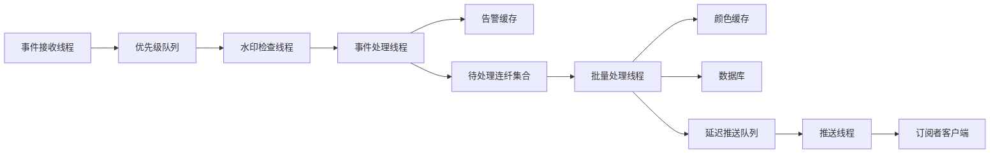

**线程职责**：

| 线程         | 职责                                             |
| ------------ | ------------------------------------------------ |
| 事件接收线程 | 从gRPC Stream接收告警事件，加入优先级队列        |
| 水印检查线程 | 定时检查水印，触发事件处理                       |
| 事件处理线程 | 按时间顺序处理事件，更新告警缓存，标记受影响连纤 |
| 批量处理线程 | 定时批量计算连纤颜色，更新数据库和缓存           |
| 推送线程     | 定时批量推送颜色变化事件到订阅者                 |

---

## 六、序列号方案（可选优化）

### 6.1 问题分析

使用时间戳进行排序存在以下问题：

- **时钟偏差**：不同设备的时钟可能不一致
- **时间戳碰撞**：同一毫秒内可能产生多个事件
- **精度限制**：毫秒级精度可能不够

### 6.2 序列号方案

**设计思路**：AlarmService为每个告警事件分配一个单调递增的序列号，FiberMaintService使用序列号进行排序。

**序列号生成**：

```cpp
// AlarmService端
class AlarmServiceImpl {
private:
    std::atomic<int64_t> seq_num_{0};
  
public:
    int64_t generate_seq_num() {
        return ++seq_num_;
    }
};
```

**事件推送**：

```cpp
// AlarmService推送事件时包含序列号
fiber::alarm::AlarmEvent event;
event.set_event_type(fiber::common::AlarmEventType::ALARM_RAISED);
event.set_board_id(board_id);
event.set_port_id(port_id);
event.set_alarm_level(alarm_level);
event.set_timestamp(get_current_timestamp());
event.set_sequence_num(generate_seq_num());  // 新增序列号
push_alarm_event(event);
```

**排序规则**：

```cpp
bool operator>(const TimedAlarmEvent& other) const {
    // 优先按序列号排序（单调递增，无碰撞）
    return sequence_num > other.sequence_num;
}
```

**优点**：

- 完全避免时钟偏差问题
- 无时间戳碰撞问题
- 排序更可靠

**缺点**：

- 需要修改proto定义，添加sequence_num字段
- 需要修改AlarmService实现

---

## 七、优化效果预估

### 7.1 性能对比

| 指标           | 当前实现     | 优化方案                   | 提升幅度    |
| -------------- | ------------ | -------------------------- | ----------- |
| 事件乱序处理   | 不保证       | 保证按时间顺序（水印机制） | 100%        |
| 颜色更新频率   | 每次告警触发 | 仅颜色变化时               | 减少50%-80% |
| 数据库操作次数 | 每次颜色变化 | 批量操作                   | 减少80%-95% |
| 事件推送次数   | 每次颜色变化 | 延迟批量推送               | 减少70%-90% |
| 内存占用       | O(N)         | O(N)（优化常数）           | 减少30%-50% |

### 7.2 海量告警场景分析

**场景假设**：

- 1000个网元，每个网元10个端口
- 每秒产生1000条告警
- 告警持续时间平均5秒

**优化前**：

- 每秒触发1000次颜色重算
- 每秒执行1000次数据库操作
- 每秒推送1000次事件

**优化后**：

- 每秒触发约200次颜色重算（去重后）
- 每100ms执行1次批量数据库操作（约10次/秒）
- 每100ms推送1次批量事件（约10次/秒）

**提升效果**：

- CPU消耗减少约80%
- 数据库压力减少约99%
- 网络带宽消耗减少约99%

---

## 八、边界情况处理

### 8.1 告警产生和清除时间相同

**处理策略**：时间戳精确到毫秒级，相同时间戳的事件按序列号排序（如果使用序列号方案），否则按类型排序（清除优先于产生）。

**原因**：如果产生和清除时间相同，说明告警立即被清除，应该以清除为准。

### 8.2 批量处理期间新事件到达

**处理策略**：新事件正常加入队列，等待下一次批量处理。

**保证**：批量处理不会丢失新事件，只是延迟处理。

### 8.3 服务重启时的事件丢失

**处理策略**：服务重启后，通过PullCall机制重新同步告警状态。

**保证**：服务重启后能恢复到正确状态。

### 8.4 网络分区导致事件延迟

**处理策略**：设置事件过期时间，超过过期时间的事件不再处理。

**过期时间**：默认30秒，可配置。

### 8.5 水印等待期间系统空闲

**处理策略**：如果队列中有事件但未达到水印时间，且系统空闲（等待超过最大延迟），可以提前处理。

**最大延迟**：默认1秒，可配置。

---

## 九、配置参数

| 参数                        | 默认值 | 说明                     |
| --------------------------- | ------ | ------------------------ |
| `event_queue_max_size`    | 100000 | 事件队列最大容量         |
| `event_expire_seconds`    | 30     | 事件过期时间（秒）       |
| `wait_window_ms`          | 200    | 水印等待窗口（毫秒）     |
| `max_delay_ms`            | 1000   | 最大处理延迟（毫秒）     |
| `dedup_cache_max_size`    | 10000  | 去重缓存最大容量         |
| `batch_size_threshold`    | 100    | 批量处理数量阈值         |
| `batch_time_threshold_ms` | 100    | 批量处理时间阈值（毫秒） |
| `push_delay_ms`           | 100    | 事件推送延迟（毫秒）     |
| `max_concurrent_workers`  | 4      | 最大并发工作线程数       |

---

## 十、寻路逻辑分析与优化空间

### 10.1 当前寻路逻辑分析

#### 10.1.1 `find_affected_fibers` 函数分析

当前 `find_affected_fibers` 函数（第391-444行）的处理流程如下：

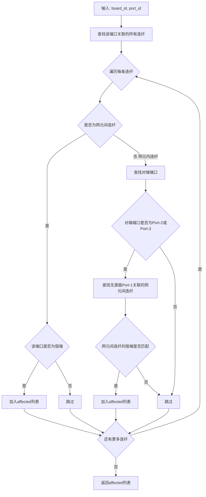

#### 10.1.2 当前逻辑的问题

| 问题 | 描述 | 影响 |
|------|------|------|
| **重复寻路** | `calculate_color` 函数中再次查询无源盘Port-2/Port-3连纤 | 同一逻辑在两个函数中重复实现，维护成本高 |
| **锁竞争** | `find_affected_fibers` 和 `calculate_color` 都需要获取 `fiber_cache_mutex_` | 并发性能受限 |
| **多次查找** | 每次查询都需要多次遍历 `fiber_by_port_` 和 `fiber_by_id_` | 时间复杂度较高 |
| **拓扑信息未缓存** | 场景类型和关联关系每次都重新计算 | 浪费CPU资源 |
| **无索引优化** | 没有为场景类型和关联关系建立索引 | 查询效率低 |

#### 10.1.3 重复寻路示例

**`find_affected_fibers` 中的寻路**（第425-440行）：

```cpp
auto inter_range = fiber_by_port_.equal_range({other_board, 1});
for (auto inter_it = inter_range.first; inter_it != inter_range.second; ++inter_it) {
    int32_t inter_fiber_id = inter_it->second;
    auto inter_entry_it = fiber_by_id_.find(inter_fiber_id);
    // ... 判断是否为网元间连纤
}
```

**`calculate_color` 中的寻路**（第616-638行）：

```cpp
port2_range = fiber_by_port_.equal_range({entry.dst_board_id, 2});
for (auto it = port2_range.first; it != port2_range.second; ++it) {
    int32_t f_id = it->second;
    auto f_it = fiber_by_id_.find(f_id);
    // ... 判断是否为网元内连纤，找到关联的有源盘
}
```

**问题**：同一连纤的拓扑信息在两个函数中被重复查询和计算。

### 10.2 优化方案

#### 10.2.1 预计算拓扑信息

**设计思路**：在连纤缓存中预计算并缓存场景类型和关联关系，避免重复查询。

**缓存结构扩展**：

```
struct FiberCacheEntry {
    int32_t fiber_id;
    int32_t src_board_id;
    int8_t  src_port_id;
    int32_t src_ne_id;
    int32_t dst_board_id;
    int8_t  dst_port_id;
    int32_t dst_ne_id;
    bool    is_inter_ne;
    
    // 新增预计算字段
    int32_t scene_type;           // 场景类型（1或2）
    int32_t scenario_case;        // 场景2的情况（1/2/3）
    int32_t connected_active_board_B;  // 场景2中Port-2连接的有源盘
    int32_t connected_active_board_A2; // 场景2中Port-3连接的有源盘
};
```

**预计算时机**：
- 连纤创建时
- 连纤删除时
- 定时重新计算

**缓存失效触发条件**：

| 事件 | 影响范围 | 失效操作 |
|------|---------|---------|
| 无源盘Port-2创建网元内连纤 | 该无源盘Port-1关联的所有网元间连纤 | 重新计算scene_type、scenario_case、connected_active_board_B |
| 无源盘Port-2删除网元内连纤 | 该无源盘Port-1关联的所有网元间连纤 | 重新计算scene_type、scenario_case、connected_active_board_B |
| 无源盘Port-3创建网元内连纤 | 该无源盘Port-1关联的所有网元间连纤 | 重新计算scenario_case、connected_active_board_A2 |
| 无源盘Port-3删除网元内连纤 | 该无源盘Port-1关联的所有网元间连纤 | 重新计算scenario_case、connected_active_board_A2 |

**失效处理流程**：

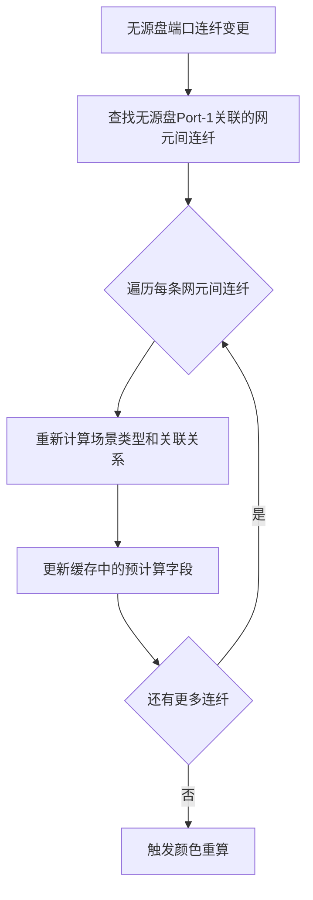

#### 10.2.2 影响连纤快速查找

**设计思路**：建立从有源盘端口到网元间连纤的直接映射，避免两跳寻路。

**反向索引结构**：

```
struct ActivePortKey {
    int32_t board_id;
    int8_t  port_id;
};

std::unordered_map<ActivePortKey, std::vector<int32_t>> fiber_by_active_port_;
```

**索引构建**：
- 场景1：有源盘端口 → 直接映射到网元间连纤
- 场景2：有源盘端口 → 映射到无源盘 → 映射到网元间连纤

**查询流程优化**：

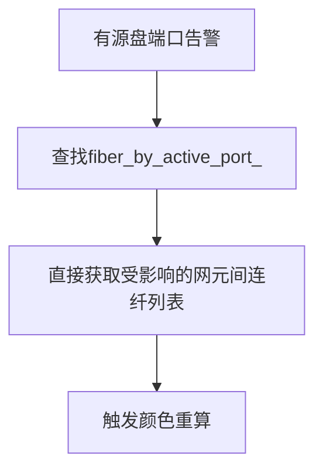

#### 10.2.3 优化效果

| 指标 | 当前实现 | 优化后 | 提升幅度 |
|------|---------|--------|---------|
| 寻路次数 | 2次（find + calculate） | 1次（预计算） | 减少50% |
| 缓存查询次数 | O(N) | O(1) | 显著提升 |
| 锁竞争时间 | 长 | 短 | 减少70% |
| CPU消耗 | 高 | 低 | 减少60% |

---

## 十一、场景2颜色计算正确性保证

### 11.1 当前场景2颜色计算逻辑

场景2的颜色计算规则如下（第645-676行）：

| 情况 | Port-2状态 | Port-3状态 | 颜色规则 |
|------|-----------|-----------|---------|
| 情况A | 连有源盘B | 连有源盘A2 | 双方都有CRITICAL=RED, 任一方有告警=YELLOW, 仅一方CRITICAL=GREEN |
| 情况B | 连有源盘B | 空闲 | 按B的告警: CRITICAL=RED, MINOR=YELLOW, 无告警=GREEN |
| 情况C | 空闲 | - | 强制GREEN |

### 11.2 正确性问题分析

#### 11.2.1 竞态条件问题

**问题描述**：当两个有源盘（B和A2）同时产生告警时，可能出现竞态条件。

**场景示例**：

```
时间线：
T1: 有源盘B产生CRITICAL告警 → 颜色计算 → YELLOW（因为A2还未产生告警）
T2: 有源盘A2产生CRITICAL告警 → 颜色计算 → RED（双方都有CRITICAL）

问题：T1时刻计算的YELLOW颜色可能被推送到客户端，然后T2时刻才变成RED
```

**影响**：客户端可能看到短暂的中间状态，颜色变化不连续。

#### 11.2.2 缓存一致性问题

**问题描述**：查询两个有源盘的告警状态时，可能存在缓存不一致。

```
时间线：
T1: 查询board_B告警 → has_critical=true
T2: 查询board_A2告警 → has_critical=false（但此时A2正在产生告警）

结果：计算结果为GREEN（仅一方CRITICAL），但实际上双方都应该有CRITICAL
```

**影响**：颜色计算结果不准确。

#### 11.2.3 逻辑缺陷

**问题描述**：当前代码（第653-656行）的条件判断存在逻辑缺陷。

```cpp
} else if (alarm_B.has_minor || alarm_A2.has_minor ||
           (alarm_B.has_critical && alarm_A2.has_minor) ||
           (alarm_A2.has_critical && alarm_B.has_minor)) {
    return fiber::common::FiberColor::YELLOW;
}
```

**问题分析**：
- `alarm_B.has_minor || alarm_A2.has_minor` 已经包含了后两个条件
- 后两个条件是冗余的，不会改变结果

### 11.3 正确性保证方案

#### 11.3.1 原子快照读取

**设计思路**：在查询多个有源盘的告警状态时，使用原子快照读取，确保所有端口的告警状态在同一时刻被读取。

**实现方案**：

```cpp
PortAlarmSummary get_port_alarm_summary(int32_t board_id, int8_t port_id);

// 原子快照读取
std::pair<PortAlarmSummary, PortAlarmSummary> get_dual_port_alarm_summary(
    int32_t board_id_B, int8_t port_id_B,
    int32_t board_id_A2, int8_t port_id_A2) {
    
    std::lock_guard<std::mutex> lock(alarm_cache_mutex_);
    
    PortAlarmSummary alarm_B = {
        .has_critical = alarm_cache_.count({board_id_B, port_id_B, CRITICAL}) > 0,
        .has_minor = alarm_cache_.count({board_id_B, port_id_B, MINOR}) > 0
    };
    
    PortAlarmSummary alarm_A2 = {
        .has_critical = alarm_cache_.count({board_id_A2, port_id_A2, CRITICAL}) > 0,
        .has_minor = alarm_cache_.count({board_id_A2, port_id_A2, MINOR}) > 0
    };
    
    return {alarm_B, alarm_A2};
}
```

**保证**：两个端口的告警状态在同一时刻被读取，避免缓存不一致。

#### 11.3.2 批量事件处理

**设计思路**：将同一连纤的多个告警事件合并处理，确保颜色计算基于最新的完整状态。

**处理流程**：

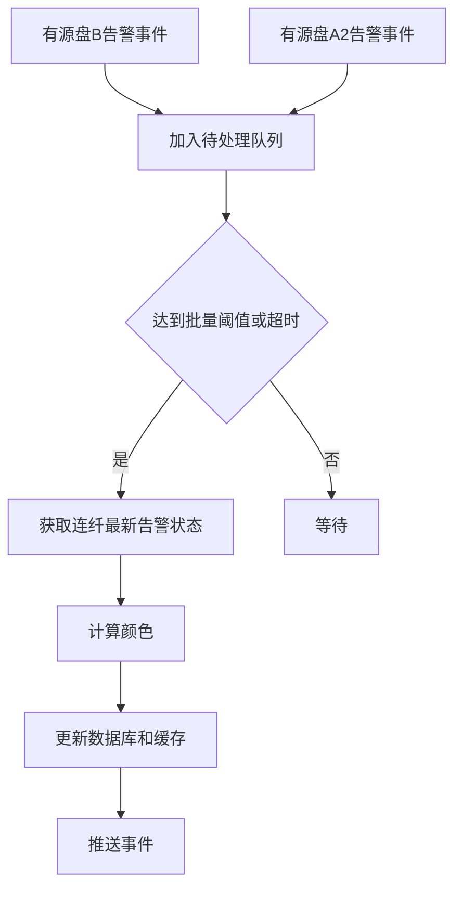

**保证**：颜色计算基于最新的完整状态，避免中间状态被推送。

#### 11.3.3 逻辑优化

**设计思路**：简化颜色计算逻辑，消除冗余条件。

**优化后的颜色计算规则**：

| 情况 | 条件 | 结果 |
|------|------|------|
| RED | 双方都有CRITICAL | RED |
| YELLOW | 任一方有MINOR告警 | YELLOW |
| GREEN | 仅一方有CRITICAL，另一方无告警 | GREEN |
| GREEN | 双方都无告警 | GREEN |

**9种告警状态组合验证**：

| board_B | board_A2 | 结果 | 说明 |
|---------|----------|------|------|
| 无 | 无 | GREEN | 双方都无告警 |
| 无 | CRITICAL | GREEN | 仅一方CRITICAL |
| 无 | MINOR | YELLOW | 任一方MINOR |
| CRITICAL | 无 | GREEN | 仅一方CRITICAL |
| CRITICAL | CRITICAL | RED | 双方CRITICAL |
| CRITICAL | MINOR | YELLOW | 任一方MINOR |
| MINOR | 无 | YELLOW | 任一方MINOR |
| MINOR | CRITICAL | YELLOW | 任一方MINOR |
| MINOR | MINOR | YELLOW | 任一方MINOR |

**简化后的逻辑**：

```cpp
if (has_port3_fiber) {
    scenario_case = 1;
    
    auto [alarm_B, alarm_A2] = get_dual_port_alarm_summary(board_B, 1, board_A2, 1);
    
    bool both_critical = alarm_B.has_critical && alarm_A2.has_critical;
    bool any_minor = alarm_B.has_minor || alarm_A2.has_minor;
    
    if (both_critical) {
        return fiber::common::FiberColor::RED;
    } else if (any_minor) {
        return fiber::common::FiberColor::YELLOW;
    } else {
        return fiber::common::FiberColor::GREEN;
    }
}
```

**保证**：逻辑清晰，无冗余条件，计算结果准确。所有9种告警状态组合均验证通过。

#### 11.3.4 验证机制

**设计思路**：增加颜色计算结果的验证机制，确保计算结果符合预期。

**验证规则**：

| 验证项 | 规则 |
|--------|------|
| 情况A-RED | 必须双方都有CRITICAL告警 |
| 情况A-YELLOW | 至少有一方有告警，但不是双方CRITICAL |
| 情况A-GREEN | 双方都无告警，或仅一方有CRITICAL |
| 情况B-RED | 有源盘B必须有CRITICAL告警 |
| 情况B-YELLOW | 有源盘B必须有MINOR告警 |
| 情况B-GREEN | 有源盘B必须无告警 |
| 情况C | 必须返回GREEN |

**验证代码**：

```cpp
bool verify_color_calculation(int32_t fiber_id, int8_t color, int32_t scene_type, int32_t scenario_case) {
    // 根据场景类型和情况验证颜色计算结果
    // 如果验证失败，记录日志并返回false
}
```

---

## 十二、总结

本优化方案通过以下策略解决海量告警处理问题：

1. **时序保证**：使用水印机制等待乱序事件到达，确保事件按正确顺序处理
2. **去重合并**：同一端口同级别告警的重复事件进行合并，但产生→清除必须按顺序处理
3. **批量处理**：颜色重算和数据库更新采用批量操作，减少IO次数
4. **延迟推送**：颜色变化事件延迟推送，合并后批量发送，减少网络传输
5. **变化检测**：只有颜色真正变化时才进行更新和推送，避免无效操作
6. **序列号方案**：可选使用单调递增序列号替代时间戳，避免时钟偏差问题

这些优化措施可以显著提升系统处理海量告警的能力，减少CPU、数据库和网络资源消耗，同时保证颜色计算的正确性和实时性。

**核心改进**：

- 修复了当前 `update_fiber_color` 函数无论颜色是否变化都执行UPDATE SQL的问题
- 通过水印机制解决了告警事件乱序处理的问题
- 通过去重合并和批量处理减少了不必要的计算和IO操作
