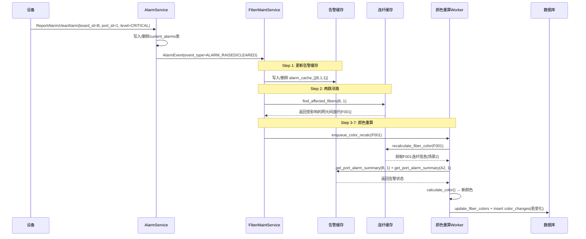
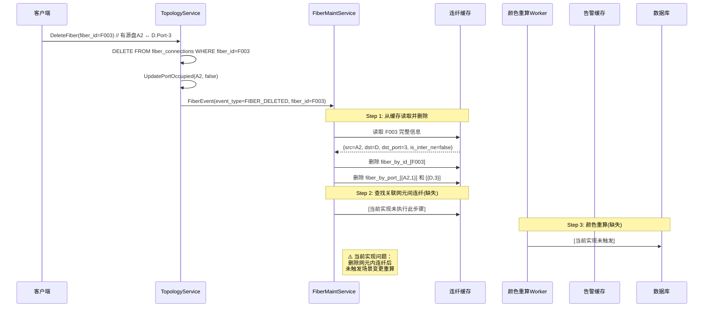
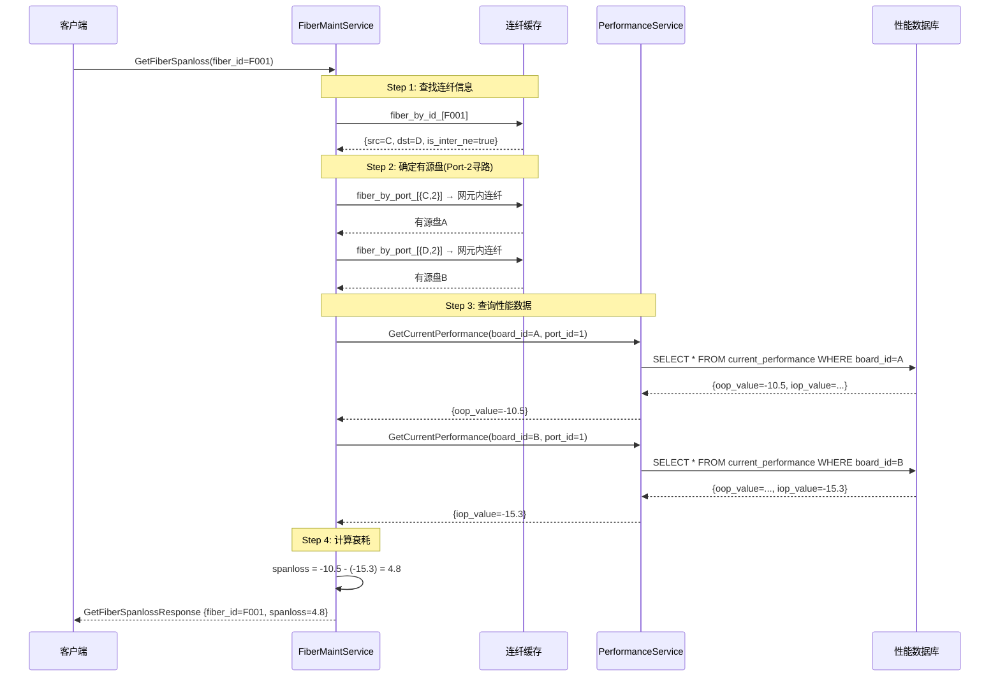
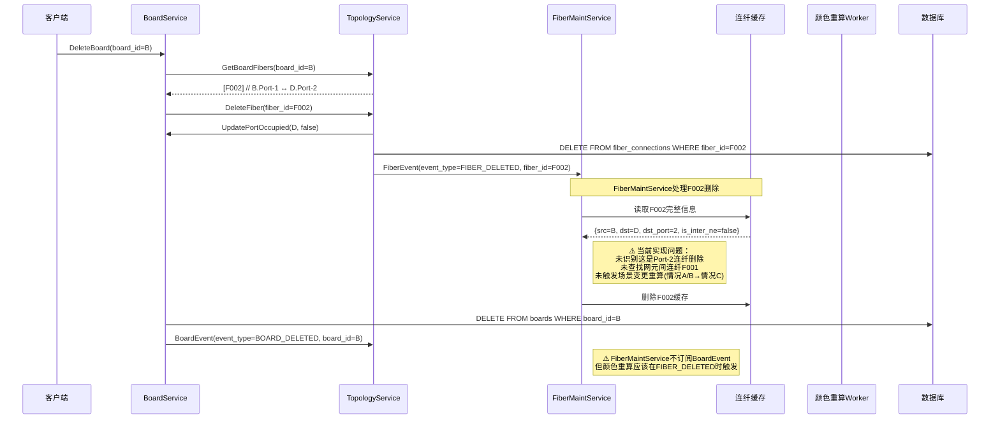

# 光纤维护服务场景分析与需求验证报告

## 报告概述

本报告基于 `需求.md` 文档，对 FiberMaintService 当前实现进行验证，分析以下四个核心场景的业务处理流程：

1. 场景2中，宿端B单盘端口设备上报产生/清除告警消息
2. 场景2中，删除宿端无源盘Port-3端口关联的连纤
3. 查询场景2网元间连纤当前衰耗
4. 在场景2中，删除宿端单盘B的完整事件链路

---

## 场景1：宿端B单盘端口设备上报产生/清除告警消息

### 需求描述

根据 `需求.md §5.3`，告警消息触发颜色重算的统一流程为：

```
AlarmEvent → Step 1: 更新告警缓存
            → Step 2: 两跳寻路，找到受影响的网元间连纤
            → Step 3: 判断告警端口在网元间连纤中的角色（仅宿端影响颜色）
            → Step 4: 判定场景类型（场景1/场景2）
            → Step 5: 从告警缓存读取宿端相关端口告警
            → Step 6: 按颜色规则计算新颜色
            → Step 7: 比较新旧颜色，变化则更新
```

### 当前实现时序图



### 需求验证

| 需求点         | 验证结果 | 说明                                                                      |
| -------------- | -------- | ------------------------------------------------------------------------- |
| 告警缓存更新   | ✅ 通过  | `process_alarm_event()` 正确写入/删除告警缓存                           |
| 两跳寻路       | ✅ 通过  | `find_affected_fibers()` 实现了两跳寻路逻辑                             |
| 仅宿端影响颜色 | ✅ 通过  | `find_affected_fibers()` 第313行判断 `entry.dst_board_id == board_id` |
| 场景判定       | ✅ 通过  | `calculate_color()` 第477-500行判定场景类型                             |
| 情况A/B/C判断  | ✅ 通过  | `calculate_color()` 第504-568行判断三种情况                             |
| 颜色规则计算   | ✅ 通过  | 符合需求文档的决策表                                                      |
| 异步重算       | ✅ 通过  | 使用工作线程队列异步执行                                                  |

### 代码参考

- [process_alarm_event](file:///e:/Work/FiberMaintain/Services/fiber_maint_service/fiber_maint_service_impl.cpp#L190-L211) - 告警事件处理
- [find_affected_fibers](file:///e:/Work/FiberMaintain/Services/fiber_maint_service/fiber_maint_service_impl.cpp#L294-L347) - 两跳寻路
- [calculate_color](file:///e:/Work/FiberMaintain/Services/fiber_maint_service/fiber_maint_service_impl.cpp#L457-L570) - 颜色计算

---

## 场景2：删除宿端无源盘Port-3端口关联的连纤

### 需求描述

根据 `需求.md §5.4.5`，网元内连纤删除（Port-3）的场景变更为：

```
FIBER_DELETED (有源盘A2 ↔ 无源盘D.Port-3)
  → 识别: 无源盘D 的 Port-3 被释放
  → 从 fiber_by_port_ 查找网元间连纤 → F001
  → 场景变更: 情况A → 情况B
  → 从告警缓存读取有源盘B的告警: get_port_alarm_summary(B, 1)
  → 按情况B规则计算新颜色
  → 比较并更新
```

### 当前实现时序图



### 需求验证

| 需求点             | 验证结果  | 说明                                           |
| ------------------ | --------- | ---------------------------------------------- |
| 从缓存读取完整信息 | ✅ 通过   | `process_fiber_event()` 第254-258行          |
| 删除连纤缓存       | ✅ 通过   | 第258-279行                                    |
| 识别端口类型       | ❌ 未实现 | 当前实现未判断被删连纤连接的是Port-2还是Port-3 |
| 查找关联网元间连纤 | ❌ 未实现 | 当前实现未查找无源盘Port-1关联的网元间连纤     |
| 场景变更判定       | ❌ 未实现 | 未判断 情况A→情况B 的场景变更                 |
| 触发颜色重算       | ❌ 未实现 | 未调用`enqueue_color_recalc()`               |

### 问题分析

当前 `process_fiber_event()` 处理 FIBER_DELETED 时，对于网元内连纤（`!entry.is_inter_ne`），仅删除缓存，**未触发任何颜色重算**。

根据需求文档 `§5.4.5` 和 `§5.4.6`，网元内连纤删除会导致场景变更：

| 删除类型                | 场景变更         | 处理要求           |
| ----------------------- | ---------------- | ------------------ |
| 有源盘 ↔ 无源盘 Port-2 | 情况A/B → 情况C | 强制变绿，触发重算 |
| 有源盘 ↔ 无源盘 Port-3 | 情况A → 情况B   | 按情况B规则重算    |

### 代码参考

- [process_fiber_event](file:///e:/Work/FiberMaintain/Services/fiber_maint_service/fiber_maint_service_impl.cpp#L213-L292) - 连纤事件处理（需修复）

---

## 场景3：查询场景2网元间连纤当前衰耗

### 需求描述

根据 `需求.md §4.5 FM-05/FM-06`，衰耗计算公式为：

$$
\text{SpanlossValue} = \text{OOP}_{\text{源端口}} - \text{IOP}_{\text{宿端口}}
$$

场景2中，需要通过拓扑寻路获取有源盘性能：

- 源端：无源盘C.Port-2 → 有源盘A.Port-1 → OOP
- 宿端：无源盘D.Port-2 → 有源盘B.Port-1 → IOP

### 当前实现时序图



### 需求验证

| 需求点             | 验证结果 | 说明                                 |
| ------------------ | -------- | ------------------------------------ |
| 连纤查找           | ✅ 通过  | 从缓存查找fiber_by_id                |
| 非网元间连纤返回0  | ✅ 通过  | `GetFiberSpanloss()` 第1037-1040行 |
| Port-2寻路找有源盘 | ✅ 通过  | 第1048-1068行                        |
| 查询OOP(源端)      | ✅ 通过  | 第1074-1083行                        |
| 查询IOP(宿端)      | ✅ 通过  | 第1085-1094行                        |
| 计算公式正确       | ✅ 通过  | `spanloss = src_oop - dst_iop`     |

### 代码参考

- [GetFiberSpanloss](file:///e:/Work/FiberMaintain/Services/fiber_maint_service/fiber_maint_service_impl.cpp#L1022-L1100) - 衰耗计算实现

---

## 场景4：删除宿端单盘B的完整事件链路

### 需求描述

根据 `需求.md §5.8` 和 `§4.3 BD-02`，删除单盘的完整事件链路为：

```
Client → BoardService.DeleteBoard(board_id=B)
  ├─ Step 1: TopologyService.GetBoardFibers(B) → [F002]
  ├─ Step 2: TopologyService.DeleteFiber(F002)
  │    ├─ BoardService.UpdatePortOccupied(D, false)
  │    ├─ DELETE FROM fiber_connections WHERE fiber_id=F002
  │    └─ 推送 FiberEvent {FIBER_DELETED, F002}
  │         └─→ FiberMaintService: 从缓存读取F002 → 场景变更 → 颜色重算 → 删除缓存
  ├─ Step 3: DELETE FROM boards WHERE board_id=B
  └─ Step 4 (最后): 推送 BoardEvent {BOARD_DELETED, board_id=B}
       └─→ TopologyService: 清理内部缓存
           ⚠️ FiberMaintService 不接收此事件
```

### 当前实现时序图



### 需求验证

| 需求点                          | 验证结果  | 说明                             |
| ------------------------------- | --------- | -------------------------------- |
| BoardService级联删除            | ✅ 通过   | BD-02 设计要求                   |
| FiberEvent推送                  | ✅ 通过   | TopologyService推送FIBER_DELETED |
| FiberMaint读取缓存              | ✅ 通过   | process_fiber_event()            |
| **识别Port-2连纤删除**    | ❌ 未实现 | **关键缺失**               |
| **查找关联网元间连纤**    | ❌ 未实现 | **关键缺失**               |
| **场景变更重算(→情况C)** | ❌ 未实现 | **关键缺失**               |
| **强制变绿**              | ❌ 未实现 | **关键缺失**               |
| FiberMaint不订阅BoardEvent      | ✅ 通过   | 符合需求设计                     |

### 问题分析

这是当前实现中最严重的问题。根据需求文档 `§5.4.5`：

```
FIBER_DELETED (网元内连纤: 有源盘B ↔ 无源盘D.Port-2)
  → 从连纤缓存读取被删连纤信息
  → 识别: 无源盘D 的 Port-2 被释放
  → 从 fiber_by_port_ 查找网元间连纤 ← [F001]
  → 场景变更: → 情况C（Port-2空闲）
  → 新颜色 = 🟢 绿色（强制）
  → 比较并更新
```

当前实现完全跳过了这个逻辑，导致删除有源盘后，关联网元间连纤的颜色不会更新为绿色。

---

## 综合验证结论

### 实现状态汇总

| 场景  | 需求点                        | 实现状态            | 优先级       |
| ----- | ----------------------------- | ------------------- | ------------ |
| 场景1 | 告警消息触发颜色重算          | ✅ 完整实现         | -            |
| 场景1 | 两跳寻路                      | ✅ 完整实现         | -            |
| 场景1 | 场景判定与颜色计算            | ✅ 完整实现         | -            |
| 场景2 | 删除网元内连纤(Port-2)→情况C | ❌ 未实现           | **高** |
| 场景2 | 删除网元内连纤(Port-3)→情况B | ❌ 未实现           | **高** |
| 场景3 | 衰耗计算                      | ✅ 完整实现         | -            |
| 场景3 | Port-2寻路                    | ✅ 完整实现         | -            |
| 场景4 | 删除单盘级联删除              | ✅ 通过BoardService | -            |
| 场景4 | FiberMaint颜色重算            | ❌ 未实现           | **高** |

### 关键问题

**问题1：网元内连纤删除未触发颜色重算**

文件：[fiber_maint_service_impl.cpp](file:///e:/Work/FiberMaintain/Services/fiber_maint_service/fiber_maint_service_impl.cpp#L213-L292)

当前 `process_fiber_event()` 处理 FIBER_DELETED 时，对于网元内连纤（`!entry.is_inter_ne`），仅删除缓存，未触发颜色重算。

**影响**：

- 删除有源盘B后，网元间连纤F001的颜色不会更新为绿色（情况C）
- 删除有源盘A2后，网元间连纤F001的颜色不会按情况B规则重算

**修复建议**：

在 `process_fiber_event()` 的 FIBER_DELETED 处理逻辑中，增加以下步骤：

```cpp
// 对于网元内连纤删除，触发场景变更重算
if (!entry.is_inter_ne) {
    // 查找无源盘Port-1关联的网元间连纤
    int32_t passive_board = (entry.src_board_id != board_B) ? entry.src_board_id : entry.dst_board_id;
    int8_t passive_port = (entry.src_board_id != board_B) ? entry.src_port_id : entry.dst_port_id;
  
    // 如果删除的是无源盘的Port-2或Port-3连纤
    if (passive_port == 2 || passive_port == 3) {
        // 查找该无源盘Port-1关联的网元间连纤
        auto inter_range = fiber_by_port_.equal_range({passive_board, 1});
        for (auto it = inter_range.first; it != inter_range.second; ++it) {
            int32_t inter_fiber_id = it->second;
            auto inter_it = fiber_by_id_.find(inter_fiber_id);
            if (inter_it != fiber_by_id_.end() && inter_it->second.is_inter_ne) {
                // 触发颜色重算
                enqueue_color_recalc(inter_fiber_id, [this, inter_fiber_id]() {
                    recalculate_fiber_color(inter_fiber_id);
                });
            }
        }
    }
}
```

### 已验证通过的功能

1. **告警消息处理**：完整实现了两跳寻路和颜色重算逻辑
2. **网元间连纤创建**：正确初始化颜色
3. **网元间连纤删除**：正确从缓存和数据库移除
4. **衰耗计算**：正确实现了拓扑寻路和性能查询
5. **启动同步**：完整实现了告警缓存和连纤缓存的全量同步

---

## 附录：场景2拓扑结构参考

```
┌──────── 网元 NE-A ────────┐              ┌──────── 网元 NE-B ────────┐
│ [有源盘 A]   [源无源盘 C] │              │ [宿无源盘 D]   [有源盘 B] │
│ ne_id=100    ne_id=100    │              │ ne_id=200     ne_id=200   │
│  Port-1 ──── Port-2(主)   │              │  Port-3(辅)── Port-1      │
│             Port-3(辅)    │              │  Port-2(主)               │
│             Port-1(网元间)─┼──────────────┼── Port-1(网元间)         │
│                          │   连纤 F001  │                            │
│  网元内连纤:             │              │  网元内连纤:               │
│  A.Port-1 ←→ C.Port-2   │              │  D.Port-2 ←→ B.Port-1    │ (F002)
│                          │              │  D.Port-3 ←→ A2.Port-1    │ (F003)
└──────────────────────────┘              └────────────────────────────┘
```

| 连纤ID | 源端      | 宿端     | 类型                       |
| ------ | --------- | -------- | -------------------------- |
| F001   | C.Port-1  | D.Port-1 | 网元间连纤（目标连纤）     |
| F002   | B.Port-1  | D.Port-2 | 网元内连纤（有源盘B连接）  |
| F003   | A2.Port-1 | D.Port-3 | 网元内连纤（有源盘A2连接） |
