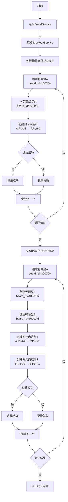
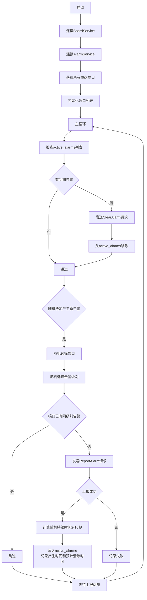
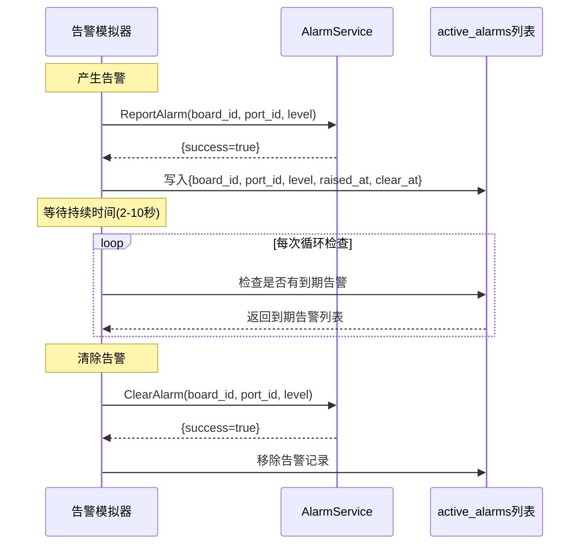
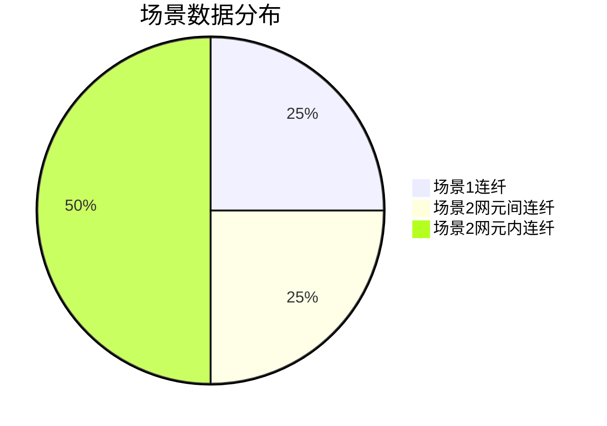

# 模拟器分析文档

## 概述

本文档分析三个模拟器的处理逻辑，包括场景模拟器、告警模拟器和性能模拟器。

---

## 1. 场景模拟器 (scene_simulator)

### 功能概述

场景模拟器用于创建测试数据，包括：
- 100个场景1（有源盘→无源盘，单跳连纤）
- 100个场景2（有源盘→无源盘→有源盘，两跳连纤）

### 处理流程



### 场景1创建详情

**拓扑结构**：
```
┌── 网元 NE-A ──┐                    ┌── 网元 NE-B ──┐
│ [有源盘 A]   │    连纤 Fxxx       │  [无源盘 P]   │
│  ne_id=100+  │    (网元间)        │   ne_id=200+  │
│  Port-1 ─────┼────────────────────┼─── Port-1     │
└───────────────┘                    └───────────────┘
```

**创建步骤**：
1. 创建有源盘A（board_id = 10000 + i, board_type = ACTIVE）
2. 创建无源盘P（board_id = 20000 + i, board_type = PASSIVE）
3. 创建网元间连纤（src_port=1, dst_port=1）

### 场景2创建详情

**拓扑结构**：
```
┌──────── 网元 NE-A ────────┐              ┌──────── 网元 NE-B ────────┐
│ [有源盘 A]   [无源盘 P]   │              │ [有源盘 B]                 │
│ ne_id=300+    ne_id=300+  │              │  ne_id=400+                │
│  Port-2 ──── Port-1(网元间)─┼──────────────┼── Port-1                  │
│             Port-2(主)    │   网元间连纤  │                            │
│             Port-3(辅)    │              │                            │
│  网元内连纤:             │              │                            │
│  A.Port-2 ←→ P.Port-1   │              │                            │
│             P.Port-2 ←→ B.Port-1       │                            │
└──────────────────────────┘              └────────────────────────────┘
```

**创建步骤**：
1. 创建有源盘A（board_id = 30000 + i, board_type = ACTIVE）
2. 创建无源盘P（board_id = 40000 + i, board_type = PASSIVE）
3. 创建有源盘B（board_id = 50000 + i, board_type = ACTIVE）
4. 创建网元内连纤1（A.Port-2 → P.Port-1）
5. 创建网元内连纤2（P.Port-2 → B.Port-1）

### 使用方式

```bash
cd /mnt/e/Work/FiberMaintain/Services/build/src/simulators
./scene_simulator [BoardService地址] [TopologyService地址]
# 默认: ./scene_simulator localhost:50051 localhost:50052
```

---

## 2. 告警模拟器 (alarm_simulator)

### 功能概述

告警模拟器用于模拟真实设备持续上报告警消息：
- 自动获取所有单盘端口信息
- 随机产生和清除告警
- 支持控制上报频率
- 确保产生时间 < 清除时间

### 处理流程



### 告警生命周期



### 关键数据结构

```cpp
struct ActiveAlarm {
    int32_t board_id;           // 单盘ID
    int32_t port_id;            // 端口ID
    AlarmLevel level;           // 告警级别(CRITICAL/MINOR)
    time_point raised_at;       // 产生时间
    time_point clear_at;        // 预计清除时间(产生时间+随机持续时间)
};
```

### 使用方式

```bash
cd /mnt/e/Work/FiberMaintain/Services/build/src/simulators
./alarm_simulator [BoardService地址] [AlarmService地址] [上报间隔ms]
# 默认: ./alarm_simulator localhost:50051 localhost:50054 1000
```

---

## 3. 性能模拟器 (performance_simulator)

### 功能概述

性能模拟器用于模拟真实设备上报性能数据：
- 自动获取所有单盘端口信息
- 为每个端口生成基准性能值
- 添加正态分布噪声模拟真实波动
- 支持控制上报频率

### 处理流程

```mermaid
flowchart TD
    A[启动] --> B[连接BoardService]
    B --> C[连接PerformanceService]
    C --> D[获取所有单盘端口]
    D --> E[为每个端口生成基准性能值]
    
    E --> F[初始化port_perfs列表]
    
    F --> G[主循环]
    
    G --> H[遍历port_perfs列表]
    H --> I[生成正态分布噪声±0.5dB]
    I --> J[计算当前OOP = 基准值 + 噪声]
    J --> K[计算当前IOP = 基准值 + 噪声]
    K --> L[限制范围: OOP∈[-40,0], IOP∈[-45,-5]]
    L --> M[发送ReportPerformance请求]
    
    M --> N{还有端口}
    N -->|是| H
    N -->|否| O[记录上报轮数]
    
    O --> P[等待上报间隔]
    P --> G
```

### 性能数据生成逻辑

```mermaid
flowchart TD
    A[端口信息] --> B[生成基准OOP]
    A --> C[生成基准IOP]
    
    B --> D[OOP基准: -35dB ~ -5dB随机]
    C --> E[IOP基准: -40dB ~ -10dB随机]
    
    D --> F[添加正态分布噪声<br/>mean=0, std=0.5]
    E --> G[添加正态分布噪声<br/>mean=0, std=0.5]
    
    F --> H[当前OOP = 基准 + 噪声]
    G --> I[当前IOP = 基准 + 噪声]
    
    H --> J[限制范围: max(-40, min(0, OOP))]
    I --> K[限制范围: max(-45, min(-5, IOP))]
    
    J --> L[上报性能数据]
    K --> L
```

### 关键数据结构

```cpp
struct PortPerformance {
    int32_t board_id;       // 单盘ID
    int32_t port_id;        // 端口ID
    double oop_base;        // OOP基准值
    double iop_base;        // IOP基准值
    double oop_current;     // 当前OOP值
    double iop_current;     // 当前IOP值
};
```

### 使用方式

```bash
cd /mnt/e/Work/FiberMaintain/Services/build/src/simulators
./performance_simulator [BoardService地址] [PerformanceService地址] [上报间隔ms]
# 默认: ./performance_simulator localhost:50051 localhost:50053 5000
```

---

## 4. 场景创建过程分析

### 场景1 vs 场景2 对比

| 特性 | 场景1 | 场景2 |
|------|-------|-------|
| 连纤类型 | 网元间连纤 | 网元间连纤 + 2条网元内连纤 |
| 拓扑结构 | 有源盘 → 无源盘 | 有源盘A → 无源盘P → 有源盘B |
| 单盘数量 | 2个 | 3个 |
| 连纤数量 | 1条 | 3条 |
| 颜色计算 | 单跳寻路 | 两跳寻路 |
| 寻路逻辑 | 直接查询宿端告警 | 查询无源盘Port-2/Port-3关联的有源盘告警 |

### 场景2的三个情况

| 情况 | Port-2状态 | Port-3状态 | 颜色规则 |
|------|-----------|-----------|---------|
| 情况A | 连有源盘B | 连有源盘A2 | 双方CRITICAL=红, 单方有告警=黄, 单方CRITICAL=绿 |
| 情况B | 连有源盘B | 空闲 | 按B的告警: CRITICAL=红, MINOR=黄, 无告警=绿 |
| 情况C | 空闲 | - | 强制绿色 |

### 场景创建后的数据分布



---

## 5. 使用建议

### 测试流程


### 参数配置建议

| 模拟器 | 推荐参数 | 说明 |
|--------|---------|------|
| 场景模拟器 | 默认参数 | 一次性创建200个测试场景 |
| 告警模拟器 | 上报间隔1000ms | 适中频率，便于观察颜色变化 |
| 性能模拟器 | 上报间隔5000ms | 与5分钟趋势采集配合 |

### 注意事项

1. **场景模拟器**应在其他模拟器之前运行，确保有足够的测试数据
2. **告警模拟器**会产生随机告警，确保告警持续时间(2-10秒)合理
3. **性能模拟器**会持续运行，建议在需要时手动停止
4. 建议在不同终端运行多个模拟器，观察并发效果